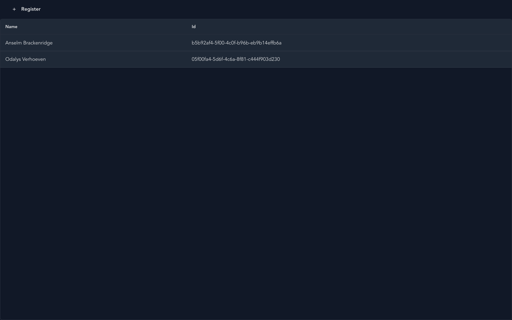

*[Cratis: from script to stage, and the long run](/from-the-edge-to-the-event-log/) · Part 09 of 26*

The dialog that registers a name in the `cratis` template has one field and no event handlers. It still keeps its button disabled while validation fails, shows a spinner while the command runs, puts a server's rejection under the field it names and closes only when the command succeeds. Two packages share that work. Arc's React package runs the command and holds the form state, and [Cratis Components](https://cratis.io/components/) draws the dialog, the field and the buttons around it.

Components is a React component library aligned with Arc application patterns. In [Cratis: from script to stage, and the long run](/from-the-edge-to-the-event-log/), a signed-in user registers an author, and author names are unique within the organization. The template you get from [*Getting started with Cratis, and the tools around it*](/getting-started-with-cratis/) already has the two screens that feature needs, a list page and a register dialog, and both are built with Components 4. [*Live UIs*](/live-uis-with-arc/) covered the live query behind the list and the props of `CommandDialog`.

## Arc underneath, Components on top

Arc's `@cratis/arc.react` owns the runtime and the state. That covers the `<Arc>` provider with the command and query runtime, `CommandForm` with its field registry and validation state, the dialog host behind `useDialog`, and the TypeScript the proxy generator writes for each command and query. Components 4 owns the React markup, its public types, the design tokens and the stable part names that style hooks target. `CommandDialog` shows the split directly. Its body is Arc's `CommandForm` wrapped around a Components `Dialog`.

Components 4 renders its own HTML. Its package manifest declares no PrimeReact, PrimeIcons or PrimeUI dependency, and a release gate checks the emitted JavaScript and declarations for Prime imports. React Aria supplies focus, keyboard, overlay and date behavior inside some components, and none of its types or class names are part of the public contract.

The package root is for setup only. Every component comes from its own subpath, such as `@cratis/components/CommandDialog` or `@cratis/components/DataPage`, and the subpaths fall into three groups. Foundation covers forms, dialogs, tables, pages, filters and notifications. Advanced React covers chat, schema and object editors, a time scrubber and a toolbar. Spatial is `Canvas` and `PivotViewer`, the only two that need the optional `pixi.js` peer. The groups describe dependencies, and they don't rank stability. Next to React 19 and the Arc range that [*Live UIs*](/live-uis-with-arc/) lists, Components needs `@cratis/fundamentals` from 7.10.3 within 7.

An application mounts both providers and tells Arc which dialogs to use for confirmations and busy states:

```tsx
import 'reflect-metadata';
import { Arc } from '@cratis/arc.react';
import { DialogComponents } from '@cratis/arc.react/dialogs';
import { CratisComponentsProvider } from '@cratis/components';
import { BusyIndicatorDialog, ConfirmationDialog } from '@cratis/components/Dialogs';
import { Authors } from './Authors/Authors';

export const App = () => (
    <Arc>
        <CratisComponentsProvider value={{ locale: 'en-US' }} toaster>
            <DialogComponents confirmation={ConfirmationDialog} busyIndicator={BusyIndicatorDialog}>
                <Authors />
            </DialogComponents>
        </CratisComponentsProvider>
    </Arc>
);
```

`<Arc>` is what the generated proxies run against, and [`CratisComponentsProvider`](https://cratis.io/components/getting-started/) doesn't replace it. The Components provider holds the locale, the labels Components renders itself, an optional renderer and, with `toaster`, the region where notifications appear. `DialogComponents` is Arc's, and it registers Components' `ConfirmationDialog` and `BusyIndicatorDialog` as the renderers behind Arc's `useConfirmationDialog` and `useBusyIndicator`, because Arc [draws no dialog itself](https://cratis.io/arc/frontend/react/dialogs/). The template splits this between `.frontend/main.tsx` and `App.tsx`, and its `main.tsx` puts `CratisComponentsProvider` outside `<Arc>`, which works as well, since both still wrap the whole app. That provider has no `toaster`, so the toasts further down never show in a template app. They go into a queue that no region displays, and nothing reports it. Adding the prop in `main.tsx` is the one change they need:

```tsx
ReactDOM.createRoot(document.getElementById('root')!).render(
    <React.StrictMode>
        <CratisComponentsProvider toaster>
            <Arc>
                <App />
            </Arc>
        </CratisComponentsProvider>
    </React.StrictMode>
);
```

The stylesheets go in the CSS entry. The template's starts like this:

```css
@import "tailwindcss";
@import '@cratis/components/tokens';
@import '@cratis/components/styles';
@import '@cratis/components/theme';
@source '../';
```

Keeping them in CSS also keeps `tsc` quiet. TypeScript 6 checks side-effect imports by default, and imported from a `.tsx` file, those three stylesheet paths fail the build with TS2882.

## The registration dialog

The template's dialog, with the names changed for authors:

```tsx
import { CommandDialog } from '@cratis/components/CommandDialog';
import { InputTextField } from '@cratis/components/CommandForm';
import { MdEdit } from 'react-icons/md';
import { RegisterAuthor } from './RegisterAuthor';

export const RegisterAuthorDialog = () => {
    return (
        <CommandDialog<RegisterAuthor>
            command={RegisterAuthor}
            title='Register author'
            okLabel='Register'
            cancelLabel='Cancel'>
            <InputTextField<RegisterAuthor>
                value={command => command.name}
                title='Name'
                icon={<MdEdit />} />
        </CommandDialog>
    );
};
```

`RegisterAuthor` isn't written by hand. After each build, Arc's [proxy generator](https://cratis.io/arc/backend/csharp/proxy-generation/) writes a class for the C# `[Command]` record, and the template ships the one for its `Register` command. Trimmed, and with the names changed, it looks like this:

```typescript
export class RegisterAuthor extends Command<IRegisterAuthor, Guid> implements IRegisterAuthor {
    readonly route: string = '/api/authors/registration';
    readonly propertyDescriptors: PropertyDescriptor[] = [
        new PropertyDescriptor('name', String, false),
    ];

    private _name!: string;

    get name(): string {
        return this._name;
    }

    set name(value: string) {
        this._name = value;
        this.propertyChanged('name');
    }
}
```

`CommandDialog` takes that class, and Arc's `CommandForm` creates an instance of it and tracks its values. The dialog walks its children. Each child that's a command form field, such as `InputTextField`, gets wrapped so it binds to the command, and anything else, a heading or a layout `div`, renders as it is, with its own children walked the same way.

The compiler checks `command => command.name` against the generated class. At runtime, Arc reads the accessor a second time, as source text, and takes the first identifier after a dot as the property name. A plain property read like `command => command.name` is all it can infer. An accessor like `command => command[key]` can't be read that way, and the field needs an explicit `fieldName`. In development, Arc warns in the console when a field stays unbound.

The `Guid` in `Command<IRegisterAuthor, Guid>` is the response type. In C#, the template's handler creates the new id and returns it with the event, so the command responds with the new id as a `Guid` from `@cratis/fundamentals`, and `onSuccess` receives it. The Kotlin and Java templates take the id from the client instead, as a `@CommandKey` on the command. Their dialog adds `initialValues={{ id: crypto.randomUUID() }}`, a UUID string made in the browser, and imports the command from `Api/`, where the Gradle plugin writes the proxies.

The confirm button is focused when the dialog opens. With a required field the button starts disabled, so a held Enter key can't confirm an empty form. A command with no input, such as a delete, has nothing to keep the button disabled, and [the `CommandDialog` guide](https://cratis.io/components/commanddialog/) recommends `initialFocus={DialogInitialFocus.Cancel}` for those.

## When the name is taken

A registration that reuses a taken name passes every client rule, so the rejection comes from the server, after **Register** is clicked. The template has no uniqueness rule. The author feature needs one, and in the template it's a Chronicle [constraint](https://cratis.io/chronicle/constraints/) on the event, `[property: Unique(message: "That name is already registered.")]` on the `Name` of the `Registered` record. [*Rules that hold when you write*](/rules-that-hold-when-you-write/) explains why the check has to live at the append. A rule that spans more than one event type goes in a class that implements `IConstraint`, the [declarative form](https://cratis.io/chronicle/constraints/declarative/), where the constraint takes the class name unless `WithName` gives it another.

With that attribute added, registering "Anselm Brackenridge" a second time through the template's dialog goes like this in .NET:

1. Chronicle refuses the append. The violation carries the constraint's name, a message, and details that name the property and the value that clashed.
2. The .NET client replaces the kernel's message with the one the constraint declared. Without a declared message, the text reads like "Event '…' on member 'name' violated a unique constraint on sequence number …", which is written for a developer. A declared message can use `{PropertyName}` and `{PropertyValue}` placeholders.
3. Arc's Chronicle integration turns each violation into a [validation result](https://cratis.io/arc/frontend/core/validation/results/). The command route answers with HTTP 400 and one result, with the message "That name is already registered.", the member `name`, the reason `constraintViolation` and the reason detail `Name`, which is the constraint's name. An unnamed `[Unique]` takes the property's name. Code that needs to know which rule failed compares `reasonDetail` and leaves the message alone.
4. The command result has `isSuccess` and `isValid` both false. `CommandDialog` calls `onFailed` and `onValidationFailure` if you passed them, puts the result on the form and stays open.
5. The form matches the result's members against each field's property name. The member is `name`, the field is bound to `name`, and the message appears under the Name field.


*The second registration of the same name, rejected by the constraint and shown under the Name field.*

The field also gets `aria-invalid="true"` and an `aria-describedby` that points at the message, which ties the message to the field for assistive technology. The dialog stays open with both buttons enabled, and editing the name clears the message. The list behind it still has two rows, because nothing was appended.

![A diagram titled A taken name, back to the field, with a small tag that reads .NET path. Six numbered boxes in two rows, joined by arrows, the second row running right to left. 1 Chronicle: append refused, constraint Name. 2 .NET client: message swapped in, the declared one. 3 Arc: validation result, member name. 4 Arc: command result, isValid false. 5 Components: dialog stays open, result on the form. 6 CommandForm: the Name field shows the message. A note along the bottom reads: the command property must share the event property's name.](./a-taken-name-back-to-the-field.png)

*The path a constraint violation takes from the kernel to the Name field, in .NET.*

Step 5 works because two names match. The member comes from the event's property, and it reaches a field only when the command has a property with the same name, as `Register.Name` and `Registered.Name` do. A validation result that matches no field has no built-in place on the form. [`CommandForm`](https://cratis.io/arc/frontend/react/command-form/) shows field errors and a form-level panel for exceptions, and that panel shows a safe default sentence, never the exception text. For a rule that doesn't map to one field, handle `onValidationFailure` yourself, or show it as a notification.

The server preflight doesn't catch it earlier. With `autoServerValidate`, the dialog calls the command's `/validate` route, which runs authorization and validation without the handler. Posting the duplicate name to `/validate` in the same app returns 200 with `isValid: true`. No event is appended there, so the constraint isn't checked, and a taken name comes back only when the user confirms.

## The author list

The template's list page, again with author names:

```tsx
import { Column, DataPage, MenuItem } from '@cratis/components/DataPage';
import { MdAdd } from 'react-icons/md';
import { AllAuthors } from './AllAuthors';

export interface AuthorsPageProps {
    onRegister(): void;
}

export const AuthorsPage = ({ onRegister }: AuthorsPageProps) => {
    return (
        <DataPage
            title='Authors'
            query={AllAuthors}
            dataKey='id'
            emptyMessage='No authors registered yet.'
        >
            <DataPage.MenuItems>
                <MenuItem label='Register' icon={MdAdd} command={onRegister} />
            </DataPage.MenuItems>
            <DataPage.Columns>
                <Column field='name' header='Name' />
            </DataPage.Columns>
        </DataPage>
    );
};
```

[`DataPage`](https://cratis.io/components/datapage/) checks what kind of query it got. A snapshot query gets a table that fetches when the page mounts and again when an argument or the page changes. An observable query gets a table that subscribes and updates as the server pushes results. `DataPage` doesn't let you change the page size of 20 rows. The C# template's listing is observable, so its list picks up a new name without a reload. The Kotlin and Java templates list with a plain query, `All`, so their list shows new names on its next fetch.



*The template's list page, a DataPage over its observable listing query. The template keeps the Id column that the author version drops.*

The two `icon` props differ in kind. `InputTextField` takes an element, `icon={<MdEdit />}`, and [`MenuItem`](https://cratis.io/components/datapage/menu-items/) takes the component, `icon={MdAdd}`. `MenuItem`'s `command` is called with no arguments. The action bar is flat. A `MenuItem` nested in another one is ignored without an error, and so is any child of `DataPage.MenuItems` that isn't a `MenuItem`.

The table covers the states a list goes through. The first load shows a loading row, a refetch keeps the old rows and marks the table busy, and an empty result shows `emptyMessage`. A failed or unauthorized query shows an alert row with `failureMessage` or `unauthorizedMessage`. The server's exception text never reaches the page.

`DataPage` needs an ancestor with a definite height, and the template's CSS gives `#root` a height of `100vh` for it. Without one, the table grows with its rows and pushes the paginator off the page, and a page with no height above it at all falls back to a minimum of `20rem`.

The page renders inside a `<main>` element, so a shell that already has one ends up with two. Each row is a tab stop that Enter or Space selects, and there's no arrow-key movement between rows. The table has no accessible name until you give it one through `tablePt={{ table: { 'aria-label': 'Authors' } }}`. With a details panel, the divider only moves with a pointer, and the panel opens beside the table at every screen width.

The feature component puts the page and the dialog together with Arc's `useDialog`:

```tsx
import { useDialog } from '@cratis/arc.react/dialogs';
import { RegisterAuthorDialog } from './Registration/RegisterAuthorDialog';
import { AuthorsPage } from './Listing/AuthorsPage';

export const Authors = () => {
    const [RegistrationDialog, showRegistrationDialog] = useDialog(RegisterAuthorDialog);

    return (
        <>
            <AuthorsPage onRegister={() => { void showRegistrationDialog(); }} />
            <RegistrationDialog />
        </>
    );
};
```

The wrapper from Arc's `useDialog` renders once, and the function next to it opens the dialog and resolves with a `DialogResult` and an optional response when it closes.

## Dialogs and notifications

Components' [dialog guide](https://cratis.io/components/dialogs/) sorts the choices by what the user does, and [*Live UIs*](/live-uis-with-arc/) covers the choice between `CommandDialog` and `Dialog`. `StepperCommandDialog` runs a command after several steps. A yes-or-no question goes through `useConfirmationDialog` and renders as `ConfirmationDialog`, and a blocking spinner goes through `useBusyIndicator` and renders as `BusyIndicatorDialog`. On a `Dialog`, `placement='start'` or `'end'` turns it into a side panel.

Anything the user doesn't have to answer is a toast. With `toaster` set on the provider, `toast.success`, `toast.warn`, `toast.error` and the rest can be called from components and from plain modules. Outside a dialog, [`toastCommandResult`](https://cratis.io/components/notifications/) turns a command result into the matching toast:

```typescript
const result = await command.execute();
if (toastCommandResult(result, { successTitle: 'Author registered' })) {
    close();
}
```

Success gives a success toast, a rejected authorization a warning, and a failed validation an error toast that lists the validation messages. Exceptions get a generic error toast, and their messages and stack traces are left for you to log. Components runs its own toast queue and region, because React Aria's toast API isn't stable.

## Tokens, parts and layers

The three stylesheets are separate on purpose. `tokens` defines the semantic `--cratis-*` variables with light defaults. `styles` is the component structure, in low-priority cascade layers, with no reset and no copy of the tokens. `theme` is optional and adds dark mode, automatic through `prefers-color-scheme` or explicit with a `cratis-dark` or `cratis-light` class, as well as forced-colors support and independently themed subtrees.

A product with its own design system leaves out `theme` and maps its values onto the Cratis tokens:

```css
:root {
    --cratis-primary-color: var(--product-accent);
    --cratis-surface-card: var(--product-surface);
    --cratis-text-color: var(--product-text);
    --cratis-focus-ring: var(--product-focus-ring);
}
```

For one component, [stable parts](https://cratis.io/components/styling/pass-through/) are the hook. Documented parts carry a `data-cratis-part` attribute, and components that support it take a typed `pt` prop with ordinary HTML attributes per part, such as a `className` for a dialog's `root` or `backdrop`. React Aria's class names and the undocumented DOM around the parts aren't styling hooks, and Components tells you not to target them.

In a Tailwind host such as the template, the layer order works against `pt`. `styles` declares its layers as `cratis-theme`, `cratis-components` and `cratis-utilities`, and cascade layers rank in the order they're first declared. Tailwind declares its own layers first, so the Cratis layers land after them and a component's own rule outranks a Tailwind utility you pass through `pt`. [Components' styling guide](https://cratis.io/components/styling/) fixes the order with one statement parsed before any stylesheet:

```css
@layer properties, theme, base, cratis-theme, cratis-components, cratis-utilities, components, utilities;
```

An application that uses a few surfaces can import `@cratis/components/styles/base` and one stylesheet per subpath, such as `@cratis/components/DataPage/styles`, in place of the whole `styles` bundle.

## Swapping the primitives

By default, Components renders everything itself. Three optional packages, [renderer adapters](https://cratis.io/components/renderers/), let a set of primitives come from another library, one for MUI 9, one for PrimeReact 11 and one for PrimeReact 10 from 10.9.9. You pick one with the provider's `library` prop:

```tsx
import { CratisComponentsProvider } from '@cratis/components';
import { muiUiLibrary } from '@cratis/components.mui';

export const Application = () => (
    <CratisComponentsProvider value={{ locale: 'en-US' }} library={muiUiLibrary}>
        <main>Application content</main>
    </CratisComponentsProvider>
);
```

Each adapter covers the same nine slots: button, icon button, text input, text area, checkbox, radio, switch, progress and surface. Tooltips, dropdowns, dialogs, date pickers and the paginator stay with Components, and so do the composites. Under the MUI adapter, a `DataPage` is still a `DataPage`, and only its buttons and other primitives can come from MUI. A slot the adapter doesn't declare falls back to the built-in one without a warning, and `rendererFallback='throw'` turns that into an error. Each adapter release requires exactly its own version of `@cratis/components`, so the two upgrade together. The PrimeReact 11 adapter needs the application's own `PrimeReactProvider` with the application's license key, and installing the adapter doesn't move key handling into it.

When a screen needs what a vendor grid does, such as grouping, row expansion, inline editing, virtualization or sorting controlled on the server, [the adapter guide](https://cratis.io/components/renderers/unsupported/) points to a custom composition next to Components, and not to anything inside `DataPage`.

## Where a view model fits

Everything above takes props, so it works the same inside a view model's view. Arc's [MVVM package](https://cratis.io/arc/frontend/react/mvvm/), `@cratis/arc.react.mvvm`, keeps screen behavior in a class that `withViewModel` binds to a component, and [*Live UIs*](/live-uis-with-arc/) walks through it with a Components dialog. The template doesn't install the package. Arc's advice is plain hooks unless a screen has substantial behavior, and a list with a register button doesn't.

## Where Components stops

The contract is React in a browser. There's no React Native, Vue, Angular or framework-neutral target.

Sorting and filtering in the tables work on the page that's loaded, and the table doesn't forward its state to the server for you. A filter over the whole result is a query argument that the server applies before paging.

The repository runs automated checks on its built-in renderer, including axe, form and event behavior in jsdom, and server rendering. Those checks aren't an accessibility conformance result, and they don't replace a review with assistive technology in your application. Some generated labels and plural text are still outside the provider's message set, so the provider can't translate every string a page shows.

Arc React's published type declarations report TS2503 errors when an application type-checks libraries with `skipLibCheck: false`. The template sets `skipLibCheck: true`.

Components 3 to 4 is a breaking upgrade. Root namespace imports, rendered markup, style parts and the provider changed. The [migration guide](https://cratis.io/components/migration/3-to-4/) comes with `@cratis/components.migrator`, a development CLI that rewrites imports and a few props, and `@cratis/eslint-plugin-components`, which stops the old imports from coming back.

---

- Previous: [Part 08 — Live UIs](/live-uis-with-arc/)
- Next: [Part 10 — Tenancy and identity end to end](/tenancy-and-identity-end-to-end/)
