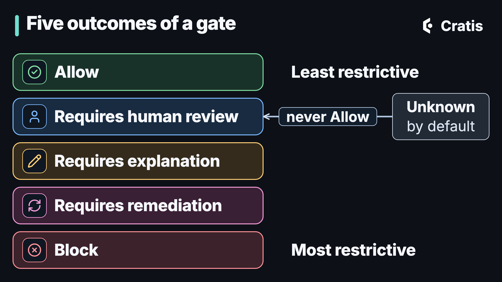

Since the Cratis Direct GitHub app was created on 26 August 2026, it has opened 320 pull requests across 20 Cratis repositories, 238 of them merged, and filed 412 issues (as of 29 September 2026). They count what the app opened and filed. How many went through a full journey, and what the work cost or saved, isn't in them. The work itself is ordinary engineering: bug fixes, dependency alignment across repositories, fixes for flaky integration tests, and, through its content journeys, blog posts and a weekly digest.

Cratis Direct is a control plane for agentic engineering. It turns repository signals into one prioritized queue of bounded AI work, checks each stage against recorded evidence, and brings the results back as pull requests. The agents do the work. Cratis Direct owns what they're allowed to start, how far each piece of work may go, what counts as done, and the evidence of what happened.

Cratis runs its own engineering on Cratis Direct today. For everyone else it's coming soon: access opens in stages at [cratis.direct](https://cratis.direct). The login there admits only accounts we've enabled.

The author feature from [From the edge to the event log](/from-the-edge-to-the-event-log/), where a signed-in user registers an author and author names are unique within the organization, arrives in Cratis Direct as an issue: two authors in one organization ended up with the same name.

## The hard part moved

Once agents can write code, the hard part moves. [Cratis Direct's page](https://cratis.direct) puts it this way: "It becomes deciding what they work on, proving what they did, and noticing when the world changed underneath them." That was our problem. Agents could investigate an issue, write the change and open a pull request, across many repositories, faster than anyone could decide what they should be doing or check what they had done. So we built the system around them.

## An agentic development life cycle

Once agents write much of the code, people have started calling the resulting life cycle an agentic development life cycle, or ADLC. [DataKnobs](https://www.dataknobs.com/agentic-ai/agentic-ai-development-life-cycle/) and [one open version](https://www.voodootikigod.com/adlc-tldr) disagree on the stages, and [IBM uses the same letters](https://www.ibm.com/think/topics/agent-development-lifecycle-adlc) for something else, the life cycle of building AI agents as products. The shape they share is that the familiar stages stay, and each one has to hand the next something an agent can read and a person can check. Ours is the issue journey in Cratis Direct. It runs Intake, Investigation, Plan, Implementation and Release, with a gate after each stage.

In ours, the work waits for a person at several points. A person admits the work and sets how far it may go. After reading the plan, a person can raise that ceiling or leave a comment that steers the next stage. A gate can hand its result to a person for review, and when remediation has failed twice, a person decides. Only a person activates a new version of the rules, and by default a person merges.

![A diagram titled Where a person decides in one journey. A column titled Stages and gates lists five stages: Intake, Investigation, Plan, Implementation and Release. A second column, A person decides, points arrows at four of them: Admit the issue, set a ceiling, at Intake; Raise the ceiling or comment, at Plan; After remediation fails twice, at Implementation; and Merge, a person by default, set per repository, at Release. Beside Investigation, without an arrow, a note reads At any gate: human review. Below, one card reads Only a person activates a new rule version, and an agent card reads One unit of work at a time.](./direct-where-a-person-decides.png)

*The work waits for a person at each marked point.*

## Who it's for

Teams that already use coding agents, or are about to, and have more repositories, issues and alerts than people to look at them. That means engineering leads who decide what agents work on, platform teams who own the rules the work has to pass, and maintainers who review what comes back.

## What it's for

An agent that starts on everything spends on everything. In Cratis Direct, classifying an issue describes it and never starts work. No work on it starts until a person admits the issue into a journey and sets a ceiling: stop after the investigation, after the plan, after the implementation, or go through to release. AI capacity is shared within a concurrency limit, with usage tracked per provider and model, so issue work spends only on what a person chose to start.

A merged pull request doesn't tell anyone what was checked. Every stage ends at a gate that evaluates recorded evidence against versioned rules, and keeps the verdict, the evidence and the rule version.

The gate that lets an agent proceed is the same evidence a reviewer reads later. Behind each pull request is its journey, with the plan, the verdicts of the gates and the evidence they read, and each repository decides how much a person has to review at all.

The world also changes under a running agent. An issue is closed mid-journey, a pull request is merged early, a worker fails, the rules change. Cratis Direct checks each journey against reality every 15 minutes and whenever something changes, stops a journey that no longer matches, and asks a person.

In Cratis Direct an alert is deduplicated and an agent investigates it straight away, so a person gets findings instead of a bare notification.

## One issue, through one journey

Cratis Direct takes in GitHub issues, pull requests and builds, plus alerts from running systems. It classifies and screens each issue without starting any work, keeps one prioritized backlog that people order, and starts work only when a person admits an issue into a journey and sets how far it may go.

### The signal

Someone files the issue in the repository that holds the author feature. GitHub issues, pull requests and builds arrive through webhooks, with a daily reconciliation to catch anything missed. Alerts from running systems arrive by webhook too, and resource probes check what's running. It works only with GitHub.

### Screened and classified

Every issue and comment is screened for spam, conduct and other content problems. Every issue is classified by its kind, how feasible it is, how critical it is, a guess at its semantic-versioning impact and which model tier suits it. A person's classification is recorded beside the machine's. Issues from people outside the team are kept from agents until someone decides. None of this starts work on the issue.

### One queue

The backlog is one ordered list across repositories. You drag to rank and drop to group, and a group is scheduled only when all its issues are ready. Triage reads the repository's vision documents. A roadmap plan can be generated from selected issues, and it stays a proposal until someone applies it. A chained issue waits until the release of the one before it exists.

### Admitted with a ceiling

A person picks the duplicate-names issue and sets how far it may go, for example "stop after the plan". That's the only way issue work starts.

### Investigation and plan

The agent does one unit of work at a time in a worker Cratis Direct launches for it, while Cratis Direct keeps the state, the sequence and the capacity. Each journey is a stream of events in [Chronicle](https://cratis.io/chronicle/), the event store the rest of this series is about, so its history is the record. No screen can set a stage directly, and what happened can be read back in order.

With the ceiling at the plan, the journey stops once the plan has passed its gate. That's where a person finds out what the agent intends to change for the duplicate names, before any code exists. They can raise the ceiling to implementation, or leave a comment, and the comment steers the next stage. A running worker can also be watched in a live console and talked to.

![A diagram titled One journey, one stream of events. A frame labeled A stream of events in Chronicle holds eight numbered rows in order: 1, Issue recorded, screened and classified; 2, Admitted, ceiling after the plan; 3, Investigation gate, tagged verdict, evidence, rule version; 4, Plan gate, with the same tag; 5, Ceiling raised to implementation, by a person; 6, Implementation gate, with the same tag; 7, Pull request opened; 8, Merged, release gate passed. A band below reads No screen sets a stage directly.](./direct-journey-stream.png)

*A journey's history is the record, in the order it happened.*

### The implementation gate

Each Cratis Direct journey moves an issue through investigation, plan, implementation and release, and each stage ends at a gate that evaluates versioned rules against recorded evidence. Unknown is never a pass: an inconclusive result goes to a person.

*The most restrictive outcome wins.*

A gate collects the rules bound to it and evaluates each against recorded evidence. The evaluators range from deterministic checks and Roslyn analysis to a decision engine, external checks and an LLM's judgment, and the gate takes the most restrictive of five outcomes: allow, requires human review, requires explanation, requires remediation, or block. A low-confidence result counts as unknown. An unknown result can't map to allow, and by default it goes to human review.

For the duplicate-names fix, the implementation gate's evidence includes the build, the specs, static analysis and an LLM check that the tests weren't weakened. That last one is judgment, not proof, and a low-confidence answer from it counts as unknown. A failing rule sends the work back for remediation, and after two attempts a person decides.

The rules are versioned. A new version is drafted, validated, simulated, reviewed and approved, only a person activates it, and a journey keeps the version it started with.

### The pull request, and who merges

Results come back as pull requests. Who merges is a per-repository setting: a person by default, or, for a repository that opts in, an agent once the change is classified as safe to merge, optionally limited to paths the repository allows.

Each pull request is on its own branch, linked to its issue and marked for review. The default is called Human, and in it a person reviews and merges. The opt-in comes in two forms. Either Cratis Direct merges a pull request on its own when a language model reads the change as safe to merge, or it first hands the uncertain ones to an agent for a full review. The classification behind each automatic merge decision is recorded with its reason. We use both the default and the opt-in on our own repositories. The release gate passes only once the pull request is merged.

![A diagram titled Who merges, set per repository. A Pull request card on the left has arrows to three rows. Human, tagged default: a person reviews and merges. Auto, tagged opt-in: merges when a language model reads the change as safe to merge. Agent review, tagged opt-in: the uncertain ones go to an agent for a full review. All three rows lead to a card on the right, Release gate, passes once merged. Below, one note reads Opt-in: optionally limited to paths the repository allows, and another reads Each automatic merge decision is recorded with its reason.](./direct-review-policy.png)

*A person by default. An agent only where the repository opts in.*

## From production back to the backlog

Cratis Direct can deduplicate an alert from a running system, have an agent investigate it, and hand a person the findings or turn the alert into a tracked issue. Turning an alert into a full journey isn't built yet, and some watchdog checks are paused while we harden them.

Alerts are deduplicated by their fingerprint, and production access is opt-in. An issue made from an alert lands back at the start of the queue, where a person decides whether it starts, like any other. That line from production back to the backlog is the step that's easiest to leave out, and it's how what the running system says becomes work someone can admit.

## Content goes through it too

The same machinery runs content. A blog journey goes Brief, Draft, Editorial review, Publish, with editorial gates, and publishing is a button a person presses. Cratis Direct's page describes the whole as five loops: deliver, assure, operate, publish and steer. The first, the issue journey, is what we mean by an agentic development life cycle.

## What it's built around

Issue work starts one way. A person admits it, with a ceiling, and nothing starts it but that admission. Gates decide from evidence and versioned rules, and the verdict, evidence and rule version stay on the journey. The application owns state, sequencing and capacity, and the agent is a replaceable worker doing one unit of work at a time. It also reaches past code, into alerts, content and the roadmap. Open any of its pull requests, and the plan, each gate's verdict and the evidence it read are on the journey behind it.

## Where it stops

It works only with GitHub. Agents are only as good as the rules the gates hold them to, and an LLM rule is judgment, not proof. Production access is opt-in. Some watchdog checks are paused while we harden them. It isn't generally available, and access opens in stages. We're building MCP access to Cratis Direct.

Nothing else in Cratis needs it. It isn't in a request's path. Cratis Direct works on the issues, pull requests and alerts around the application. It earns its place when agent work outgrows what one person can watch. For one repository and one assistant, the AI corpus and the checks in [*AI across the stack*](/ai-across-the-cratis-stack/), plus your CI, may well be enough.

We run our own engineering on it today. For everyone else it's coming soon at [cratis.direct](https://cratis.direct).

---

Part 20 of 23 in the Cratis series. The series starts at [From the edge to the event log](/from-the-edge-to-the-event-log/).

- Previous: [Cratis Studio: one event model for the whole team](/cratis-studio-event-modeling-together/)
- Next: [AI across the Cratis stack](/ai-across-the-cratis-stack/)
