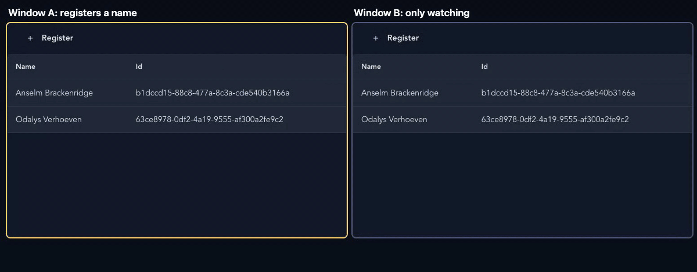

import { Tabs, TabItem } from '@astrojs/starlight/components';

*[Cratis: from script to stage, and the long run](/from-the-edge-to-the-event-log/) · Part 09 of 25*

In Arc, the difference between a query that loads a list once and a query that keeps pushing new results to a React screen is the return type of one C# method, as long as the data it returns comes from a source that notifies on change. Return a list and the browser gets a snapshot. Return an `ISubject` of that list and the generated hook subscribes, and the server pushes later results to it over Server-Sent Events or WebSocket. The C# record stays the same. The generator writes an observable query class instead of a plain one, and the component still calls `.use()`, whose tuple is `[result, setSorting]` instead of `[result, perform, setSorting]`.

In [Cratis: from script to stage, and the long run](/from-the-edge-to-the-event-log/), a signed-in user registers an author, and author names are unique within the organization. The screen for that feature needs two things: a list of authors that shows a new one without a reload, and a form that registers one. Both sit on the TypeScript that Arc generates from the backend, and both are about the same question, which is what the browser knows and when it learns it.

## A live query is a return type

A C# [model-bound query](https://cratis.io/arc/backend/csharp/queries/model-bound/) is a static method on a `[ReadModel]` record. Returning `ISubject<IEnumerable<T>>`, or `ISubject<T>` for one item, makes it an [observable query](https://cratis.io/arc/backend/csharp/queries/model-bound/observable-queries/). The Ideas board in the Cratis Samples repository keeps its ideas in memory and observes them:

<Tabs syncKey="language">
<TabItem label="C#">

```csharp
[ReadModel, AllowAnonymous]
public record Idea(IdeaId Id, IdeaTitle Title, IdeaSummary Summary)
{
    public static ISubject<IEnumerable<Idea>> ObserveIdeas(IdeaStore store) => store.Observe();
}

public sealed class IdeaStore : IDisposable
{
    readonly Lock _gate = new();
    readonly BehaviorSubject<IEnumerable<Idea>> _ideas = new([]);

    public void Capture(Idea idea)
    {
        lock (_gate) { _ideas.OnNext([idea, .. _ideas.Value]); }
    }

    public ISubject<IEnumerable<Idea>> Observe() => _ideas;

    public void Dispose() => _ideas.Dispose();
}
```

</TabItem>
<TabItem label="Kotlin">

Arc for Kotlin returns a `Flow` from the query, and a `MutableStateFlow` holds the current value for snapshot reads.

```kotlin
@ReadModel
@AllowAnonymous
data class Idea(val id: IdeaId, val title: IdeaTitle, val summary: IdeaSummary) {
    companion object {
        @JvmStatic
        fun observeIdeas(@FromServices store: IdeaStore): Flow<List<Idea>> = store.observe()
    }
}

@Component
class IdeaStore {
    private val ideas = MutableStateFlow<List<Idea>>(emptyList())

    fun capture(idea: Idea) {
        ideas.update { listOf(idea) + it }
    }

    fun observe(): Flow<List<Idea>> = ideas
}
```

</TabItem>
<TabItem label="Java">

Arc for Java returns a JDK `Flow.Publisher` from the query, and `ObservableState` holds the current value for snapshot reads.

```java
@ReadModel
@AllowAnonymous
public record Idea(IdeaId id, IdeaTitle title, IdeaSummary summary) {
    public static Flow.Publisher<List<Idea>> observeIdeas(@FromServices IdeaStore store) {
        return store.observe();
    }
}

@Component
public final class IdeaStore {
    private final ObservableState<List<Idea>> ideas = new ObservableState<>(List.of());

    public synchronized void capture(Idea idea) {
        var updated = new ArrayList<Idea>();
        updated.add(idea);
        updated.addAll(ideas.get());
        ideas.set(List.copyOf(updated));
    }

    public Flow.Publisher<List<Idea>> observe() {
        return ideas;
    }
}
```

</TabItem>
<TabItem label="TypeScript">

Arc for TypeScript returns an RxJS `Observable` from a `@query({ observable: true })` method, and a `BehaviorSubject` holds the current value.

```typescript
export class IdeaStore {
    readonly #ideas = new BehaviorSubject<Idea[]>([]);

    capture(idea: Idea): void {
        this.#ideas.next([idea, ...this.#ideas.value]);
    }

    observe(): Observable<Idea[]> { return this.#ideas; }
}

@readModel()
@allowAnonymous()
export class Idea {
    @field(IdeaId) id!: IdeaId;
    @field(IdeaTitle) title!: IdeaTitle;
    @field(IdeaSummary) summary!: IdeaSummary;

    @query({ observable: true }, service(IdeaStore))
    static observeIdeas(store: IdeaStore): Observable<Idea[]> { return store.observe(); }
}
```

</TabItem>
<TabItem label="Elixir">

Arc for Elixir doesn't exist; use the Chronicle Elixir client directly.

</TabItem>
</Tabs>

In .NET, `Task<ISubject<T>>` is allowed as well, and an arbitrary `IObservable<T>` isn't something Arc discovers as a query. You can compose with Rx operators such as `Select` or `CombineLatest`, as long as the subscription you return releases every upstream subscription when it's disposed and passes terminal errors on. The direct transports dispose the subscription they receive.

The return type alone doesn't open a connection. The client decides whether it wants a one-off snapshot, a direct SSE or WebSocket connection, or a subscription on a shared hub, and the default is the hub.

For `ObserveIdeas`, the proxy generator writes an `ObservableQueryFor<Idea[]>` class. A parameterless query over a list gets a `use(sorting?)` hook that returns the result and a function to change the sorting. It also gets `useWithPaging`, `useSuspense`, `useSuspenseWithPaging`, `useChangeStream` and a `when(condition)` helper. Rename a property in C#, rebuild, and the generated types and every field accessor that used the old name stop compiling until you fix them, the same way commands behave in [*Arc: commands and queries without the plumbing*](/arc-commands-and-queries/).

Arc's [real-time tutorial](https://cratis.io/arc/tutorial/real-time/) includes a two-tab test. Open the app in two browser tabs connected to the same backend process, add a book in one, and the other updates without a reload. That test covers the tutorial's own path. A write from a second backend process is a separate case, and it depends on where the data lives.



*The same check on the Cratis web template's name list, with two windows side by side.*

## From a write to the screen

The samples show two paths, and they differ in what sits between the command and the subject the query returns.

In the .NET Ideas board there's no event store. The command's `Handle(IdeaStore store)` calls `store.Capture(...)`, which pushes a new list into the `BehaviorSubject`. The query returns that same subject, so every subscriber gets the new list, the hub sends it to the browser and the hook re-renders. The command writes to a current-state store, and the query observes that same store.

With Chronicle and MongoDB, the chain is longer. In .NET, this is the author list from Cratis's [full-app walkthrough](https://cratis.io/build-a-full-app/):

<Tabs syncKey="language">
<TabItem label="C#">

```csharp
[ReadModel]
[FromEvent<AuthorRegistered>]
public record Author(AuthorId Id, string Name)
{
    public static ISubject<IEnumerable<Author>> AllAuthors(IMongoCollection<Author> collection) =>
        collection.Observe();
}
```

</TabItem>
<TabItem label="Kotlin">

Arc for Kotlin and Java observe the collection with `MongoObservableQuery`, which resumes its MongoDB change stream after transient failures.

```kotlin
@ReadModel
@io.cratis.chronicle.readModels.ReadModel
@FromEvent(AuthorRegistered::class)
data class Author(
    @FromEventSourceId val id: AuthorId = AuthorId(UUID(0, 0)),
    val name: String = ""
) {
    companion object {
        @JvmStatic
        fun allAuthors(@FromServices queries: MongoObservableQuery): Flow<List<Author>> =
            queries.observe<Author>()
    }
}
```

</TabItem>
<TabItem label="Java">

Arc for Kotlin and Java observe the collection with `MongoObservableQuery`, which resumes its MongoDB change stream after transient failures.

```java
@ReadModel
@io.cratis.chronicle.readModels.ReadModel
@FromEvent(eventType = AuthorRegistered.class)
public class Author {
    @FromEventSourceId
    public AuthorId id = new AuthorId(new UUID(0, 0));

    public String name = "";

    public static Flow.Publisher<List<Author>> allAuthors(@FromServices MongoObservableQuery queries) {
        return queries.observePublisher(Author.class);
    }
}
```

</TabItem>
<TabItem label="TypeScript">

In Arc for TypeScript, `ChronicleReadModels` watches the read model through Chronicle. `mongoCollection(...).observe()` is the MongoDB change-stream form.

```typescript
@readModel()
@fromEvent(AuthorRegistered)
export class Author {
    @field(AuthorId) id!: AuthorId;
    @field(String) name!: string;

    @query({ observable: true }, service(ChronicleReadModels))
    static allAuthors(models: ChronicleReadModels): Observable<Author[]> {
        return models.observeAll(Author, author => author.id.toString());
    }
}
```

</TabItem>
<TabItem label="Elixir">

Arc for Elixir doesn't exist; use the Chronicle Elixir client directly.

</TabItem>
</Tabs>

The command returns an `AuthorRegistered` event and Chronicle appends it. In .NET, the projection declared by `[FromEvent<AuthorRegistered>]` writes the `Author` document to MongoDB. `collection.Observe()` sees that document change through a MongoDB change stream, and Arc pushes the new result to every subscribed client.

![A diagram titled The live hop, seven numbered cards in two rows joined by arrows. 1 Command, Arc. 2 Event appended, Chronicle. 3 Projection, declared by you and run by Chronicle, writes to MongoDB. The arrow from 3 turns down to the second row and is labeled eventually consistent. 4 Change stream, Arc Observe. 5 SSE hub at slash dot cratis slash queries slash sse. 6 The use hook. 7 Screen. A band at the bottom reads: You write steps 1 and 6 and the query's ISubject return type. Arc and Chronicle run steps 2 to 5.](./the-live-hop.png)

*The Chronicle path to the screen. The UI observes the document, not the event log.*

In .NET, `Observe()` is database observation. It watches the MongoDB collection the projection writes to, and it isn't a Chronicle projection or a Chronicle API. Change streams need a MongoDB replica set or a supported sharded deployment. If the MongoDB watcher fails, Arc logs the failure and completes the stream instead of raising an error, so a stream that completed doesn't prove the data is current. Arc for Kotlin and Java observe the collection with `MongoObservableQuery`, which resumes its MongoDB change stream after transient failures, and Arc for TypeScript's experimental Chronicle integration watches the read model through Chronicle.

The read model catches up after the append, asynchronously. A command that returns success has recorded the event. The projection may not have written the document yet, and the screen may not have changed yet either. There's nothing to refresh by hand, and also nothing that promises the list has updated by the time the command's promise resolves.

For EF Core in .NET, an observed `DbSet` gets in-process notifications from Arc's `SaveChanges` interceptor. SQLite relies on that path only. SQL Server and PostgreSQL can pick up writes from other processes once their database notification setup is in place. If that setup fails, EF observation can fall back to in-process only. Without a notification source, an observable query can stay connected and never send fresh data.

## How the result travels

Two settings on `<Arc>`, `queryTransportMethod` and `queryDirectMode`, choose the [transport](https://cratis.io/arc/frontend/react/queries/observable-query-multiplexing/), and they're independent of each other:

| Transport | Direct mode | What happens |
|---|---|---|
| SSE (React default) | off | One shared EventSource at `/.cratis/queries/sse`; subscribe and unsubscribe are POSTs |
| WebSocket | off | One shared socket at `/.cratis/queries/ws`; subscribe and unsubscribe are socket messages |
| SSE or WebSocket | on | One connection per query URL, bypassing the hub |

On the SSE hub, `GET /.cratis/queries/sse` answers with a `connected` message and a connection id. The client then POSTs each subscription with the connection id, a subscription id, the query name and its arguments, and results come back tagged with the subscription id. Many subscriptions share one EventSource, and the client handles reconnecting and subscribing again.

`<Arc>` defaults to the SSE hub with one connection slot. SSE hub connections are capped at four, so that the browser's per-origin connection limit under HTTP/1.1 still leaves room for the control POSTs. HTTP/2 doesn't lift Arc's cap, and direct SSE connections are outside it. The multiplexer is module-global, shared by every `<Arc>` on the page, so nesting a second `<Arc>` doesn't give you an isolated hub.

An observable query is also an ordinary `GET`. If the observable hasn't emitted yet, the server answers 202 with `isReady: false`. For MongoDB's `Observe()`, a snapshot without `waitForFirstResult` always answers 202 and can leave its watcher running, so use `waitForFirstResult=true` there. `waitForFirstResult=true` makes it wait for the first emission, 30 seconds by default, adjustable with `waitForFirstResultTimeout`, and a timeout is a 408. HTTP snapshots bypass read-model interception and emission guards, so masking or guarding that only happens on the streaming path doesn't protect the snapshot endpoint.

For collection subscriptions on the hub, each item needs a stable, unique `Id` for Arc to send change sets in `delta` mode. Without one, Arc sends the whole collection every time and logs a warning once per subscription. When something looks wrong, `arc.observableQueryDiagnostics.getSnapshot()` and `snapshots$` show the transport, the multiplexer's state, the cache and a health summary.

## One hook and its states

The board's React component is short. Adapted from the sample, with plain elements in place of its toolbar and inputs, it reads:

```tsx
export const Board = withViewModel(BoardViewModel, ({ viewModel }) => {
    const [ideasResult] = ObserveIdeas.use();
    const [CaptureDialog, showCaptureDialog] = useDialog(CaptureIdeaDialog);
    const ideas = viewModel.filter(ideasResult.data ?? []);

    return (
        <main>
            <button onClick={() => { void showCaptureDialog(); }}>Capture idea</button>
            <input value={viewModel.searchTerm}
                   onChange={event => viewModel.setSearchTerm(event.target.value)} />
            {ideasResult.isPerforming && !ideasResult.hasData && <p>Connecting to the live board…</p>}
            {ideas.map((idea, index) => <IdeaCard key={idea.id.toString()} idea={idea} sequence={index + 1} />)}
            <CaptureDialog />
        </main>
    );
});
```

`ObserveIdeas.use()` returns a tuple, `[result, setSorting]`, and an observable query for a single item returns `[result]`. The first line destructures it and keeps the result, which is the element the component reads.

The result carries `data`, `isSuccess`, `isReady`, `isAuthorized`, `isValid`, `hasExceptions`, `paging` and `isPerforming`. Two of those are easy to confuse. `isReady` says a result has been produced. `isPerforming` says the client is fetching or subscribing right now. The initial state isn't ready, and `isReady: false` after a 202 is transient and isn't a failure. The board shows its "Connecting" line only while it's performing and has no data yet.

`ObserveSingle` and `ObserveById` emit `null` when the document is gone, including when it was removed through `[RemovedWith<T>]`, and the subscription stays open. Guard with `hasData` or `isReady` before you read a property.

Each `<Arc>` mount keeps a [query instance cache](https://cratis.io/arc/frontend/react/queries/query-instance-caching/), keyed by the query name and its arguments. Components that use the same query with the same arguments share one subscription. When the last of them unmounts, the subscription stays open for `queryCacheRetentionMs`, 30,000 ms by default, so going back to a screen doesn't start from empty. It isn't an isolation boundary between users.

[`useChangeStream(getKey)`](https://cratis.io/arc/frontend/react/queries/change-stream/) gives you what was added, replaced and removed since the last result. Arc computes it by comparing snapshots, on the server or in the client, so a write that happened between two emissions and was overwritten before the second one can be missing from the delta. It's a view of the difference between results. When every operation matters, read the event log. A reconnect creates a new subscription, and it doesn't resume from where the old one stopped.

## A subscription that stays open

Authorization for an observable query runs once, when the subscription is established. The attributes from [*Arc: commands and queries without the plumbing*](/arc-commands-and-queries/) are checked then, and the verdict doesn't expire on its own when a token does or when a role is revoked. Keep-alive pings stop proxies from dropping the connection, and the client reconnects by itself, so a subscription can outlive the session that opened it.

For re-checking during a long subscription, Arc has [emission guards](https://cratis.io/arc/backend/csharp/queries/observable-query-emission-guards/). A class implementing `IGuardObservableQueryEmission` is discovered by convention, and Arc asks it about every emission on every transport, the hub, direct WebSocket and direct SSE alike. It answers `Allow`, `Suppress` for a single emission, or `DenyAndTerminate`. Guards cover streaming emissions only, not the HTTP snapshot. On a WebSocket the principal is the one from the handshake. A guard that throws counts as `DenyAndTerminate`. A filter can capture a serializable `QueryContext.SubscriptionScope` after the filters succeed and before the query runs, and the guard gets a fresh copy of it for each emission. An application without a guard pays nothing per emission. Controller-based queries always get a null subscription scope.

## The form

After each build, Arc's [proxy generator](https://cratis.io/arc/backend/csharp/proxy-generation/) writes a TypeScript version of the command, and [Components](https://cratis.io/components/) binds a form to it. Following the Components [form recipe](https://cratis.io/components/building-a-form/), the form looks like this. `RegisterAuthor` is the generated proxy class, not something you write:

```tsx
<CommandDialog<RegisterAuthor>
    command={RegisterAuthor}
    title='Add author'
    okLabel='Add'
    initialValues={{ id }}
    validateOn='change'
    onSuccess={() => console.info('Author registered')}
>
    <InputTextField<RegisterAuthor>
        value={(command) => command.name}
        title='Name'
        placeholder='Sample Author'
    />
</CommandDialog>
```

The field accessor is typed against the command. Rename `Name` in C#, rebuild, and that line stops compiling. That's why we generate the proxy at all, so drift between frontend and backend shows up as a compile error in your own build. **Add** stays disabled until the validation rules the backend shared with the proxy pass, and server messages land on their fields.

Only a [supported subset of the rules](https://cratis.io/arc/backend/csharp/proxy-generation/validation/) makes it across. Custom predicates and dependency-backed checks aren't translated into browser logic, and conditions aren't reproduced either, so a recognized rule inside a condition can become unconditional on the client. Inspect and test the generated validation, and keep in mind the server remains authoritative. A full regeneration clears the proxy output folder, handwritten files included, so give the generator a folder of its own. [The proxy boundary](https://cratis.io/arc/understanding-the-proxy-boundary/) explains what crosses it.

### What CommandDialog does for you

A [`CommandDialog`](https://cratis.io/components/commanddialog/) takes the command's constructor. It creates the command, validates it and keeps the confirm button disabled until client validation passes. On confirm it runs the command and shows a busy state, with the buttons and fields disabled and a spinner. Server field errors land on their fields, and a success closes the dialog with `DialogResult.Ok`. Cancel, the close button, Escape and a click on the backdrop close it with `Cancelled` and fire no callback.

The Ideas board's dialog seeds a value that no field shows, the new idea's id.

```tsx
export const CaptureIdeaDialog = () => (
    <CommandDialog<CaptureIdea>
        command={CaptureIdea}
        title="Capture an idea"
        okLabel="Add to board"
        initialValues={{ id: Guid.create(), title: '', summary: '' }}>
        <InputTextField<CaptureIdea>
            value={command => command.title}
            title="Title"
            placeholder="Make local setup self-explanatory"
        />
    </CommandDialog>
);
```

A generated proxy starts with every property unset, and a required `Guid` isn't filled in for you. A value that no field renders, such as the new idea's id, goes in `initialValues`, which counts toward validity. The sample calls `Guid.create()` inline, which makes a new id on every render. The `CommandDialog` guide recommends creating it once, for example with `useState(() => Guid.create())`. `onBeforeExecute` can transform values too, but it runs after confirm, which is too late to make an invalid command valid.

With `autoServerValidate`, the dialog also calls the command's `/validate` route once local checks have settled, after 500 ms by default. The option has `Throttle` in its name and behaves as a debounce. The server runs its filters and validators, including rules that need a database, and skips the handler. A passing preflight reserves nothing, so a name that's free during typing can be taken by the time someone clicks **Add**, and the uniqueness constraint still decides.

The rule for choosing is in Components' own [guide](https://cratis.io/components/choosing-a-component/). If confirming the dialog executes a generated command, use `CommandDialog`. If the dialog only gathers values and hands them back, use `Dialog`.

Arc also has [dialogs without Components](https://cratis.io/arc/frontend/react/dialogs/). `useDialog<TResponse, TInput>(Component)` returns three elements: the wrapper to render, a function that shows the dialog and the dialog's context. Showing it resolves to a `DialogResult` and an optional response. `DialogResult` has `None`, `Ok`, `Yes`, `No` and `Cancelled`. `useConfirmationDialog` resolves to a bare `DialogResult`. Arc draws no dialog itself, and `DialogComponents` is where you supply the confirmation and busy renderers. One dialog hook stores one pending result, so don't open the same one twice at once.

## When a screen has behaviour

The board wraps its component in `withViewModel`. [Arc's MVVM support](https://cratis.io/arc/frontend/react/mvvm/using-view-model/) makes the view model an `@injectable()` class from tsyringe, observable through MobX, and the view re-renders when a property it read changes.

In the Ideas board, the whole view model is this:

```typescript
import { injectable } from 'tsyringe';
import { Idea } from './Idea';

@injectable()
export class BoardViewModel {
    searchTerm = '';

    setSearchTerm(value: string) {
        this.searchTerm = value;
    }

    filter(ideas: Idea[]): Idea[] {
        const normalizedSearch = this.searchTerm.trim().toLowerCase();
        if (!normalizedSearch) {
            return ideas;
        }

        return ideas.filter(idea =>
            idea.title.toLowerCase().includes(normalizedSearch) ||
            idea.summary.toLowerCase().includes(normalizedSearch));
    }
}
```

Filtering the list that's already loaded is view behaviour, so it lives in the view model, and a spec in the sample tests the filter by title and summary without rendering anything. The live data still comes from the hook in the component.

`withViewModel` observes only the render of the component it wraps. A child component that reads observable view-model state directly sits outside that boundary and won't re-render when the state changes. Pass plain values down as props, or wrap the child in `observer()` from `@cratis/arc.react.mvvm`.

A view model can ask the user something through `IDialogs`, with `show`, `showConfirmation` and `showBusyIndicator`, and the view registers the dialogs it can show. The [MVVM `useDialog`](https://cratis.io/arc/frontend/react/mvvm/dialogs/) takes a request type and a component and returns two elements, the wrapper and the function that shows it, which is one fewer than the base hook. Arc's own advice is to stay with plain hooks unless a screen has substantial behaviour.

## Tables and pages

For the author list, a table is often the right screen. `DataTableForObservableQuery` from Components subscribes when it mounts and unsubscribes when it unmounts, and rows appear, change and disappear as the server pushes results:

```tsx
export function LiveAuthors() {
    return (
        <div style={{ height: '480px' }}>
            <DataTableForObservableQuery query={AllAuthors} emptyMessage='No authors yet' dataKey='id'>
                <Column field='name' header='Name' sortable />
            </DataTableForObservableQuery>
        </div>
    );
}
```

`AllAuthors` is the generated proxy for the Chronicle-backed query above. The [table](https://cratis.io/components/datatables/data-table-for-observable-query/) needs a parent with a definite height, which is why the example wraps it in a 480-pixel box. Set `dataKey`, or the selection is lost when an update arrives. Server paging is 20 rows per page. Sorting, column filters and the global search all work on the page that's loaded, so filtering across the whole result belongs in query arguments, before paging.

`DataPage` puts a table like that into a page with an action bar and a resizable details panel. `DataPage.MenuItems` holds the actions, and `disableOnUnselected` ties an action to having a row selected. Components' [list-screen recipe](https://cratis.io/components/list-screen-with-actions/) wires a live table to two `CommandDialog` actions, and with Chronicle the new row arrives once the projection has updated the read model. Grouping, row expansion and controlled server-side sorting aren't part of the Components tables.

Components needs React 19, and `@cratis/arc` and `@cratis/arc.react` in the range from 20.3.1 up to, but not including, 23.

![A diagram titled One proxy, four consumers. At the top left, a C# query, ObserveIdeas, returning an ISubject of IEnumerable of Idea, with an arrow labeled build down to the generated ObserveIdeas class, an ObservableQueryFor of Idea array. Four arrows lead from it to the right: use, giving the list; useChangeStream, giving added, replaced and removed; DataTableForObservableQuery, giving live rows, 20 per page; and DataPage, giving a table, actions and a details panel. A note at the top right reads: Components needs React 19 and @cratis/arc from 20.3.1 up to, but not including, 23.](./one-proxy-four-consumers.png)

*The same generated query class feeds a hook, a change stream, a table and a page.*

## Which hop is live

For the author screen, the list and the form meet in one place. The form's command appends `AuthorRegistered`, the projection writes the document, the change stream notices, and the hub pushes a new list to every tab that subscribed. The screen code is a hook call and a dialog, and on the backend it's a return type and an `Observe()` call, over a projection you declared.

Each hop has its own terms. The projection writes the document after the append, asynchronously, and the change stream reports changes to that document. A snapshot `GET` skips read-model interception and emission guards, and for MongoDB it needs `waitForFirstResult` to return data. Deltas compare snapshots and can miss a write between two results. Authorization is checked at subscribe time unless a guard checks each emission. A live screen built on Arc tells the browser about new results of a query, and the event log remains the place to look when each individual change matters.

The Kotlin and TypeScript servers expose observable queries too, each with its own shape on the backend and its own differences from .NET, which [*Beyond .NET*](/beyond-dotnet/) goes through.

---

- Previous: [Part 08 — Arc: commands and queries without the plumbing](/arc-commands-and-queries/)
- Next: [Part 10 — Beyond .NET](/beyond-dotnet/)
