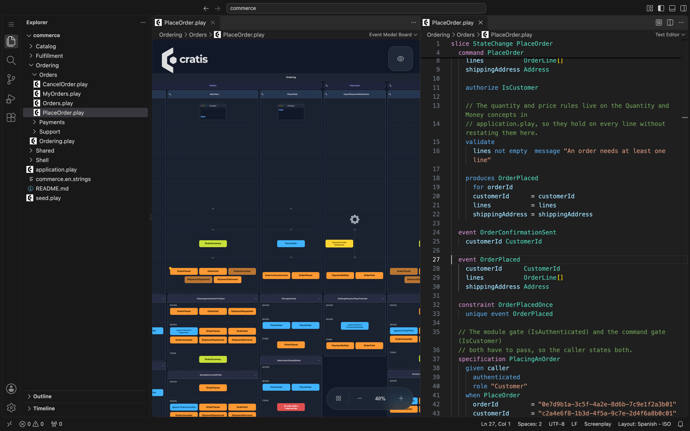
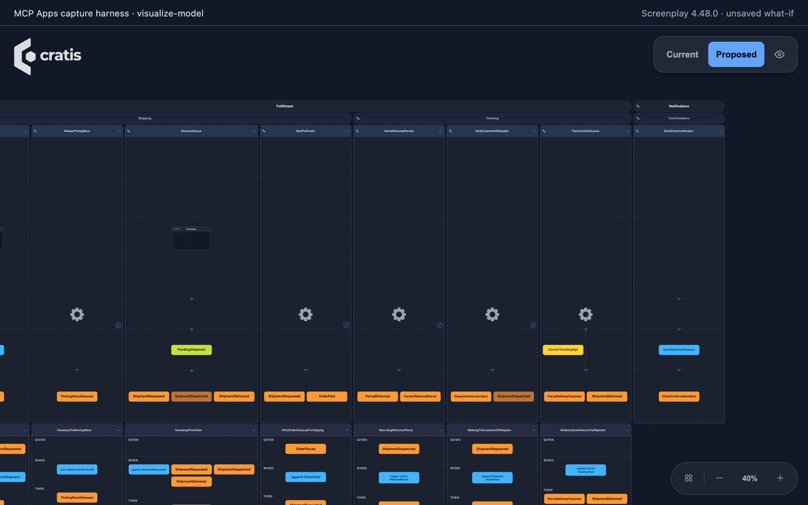
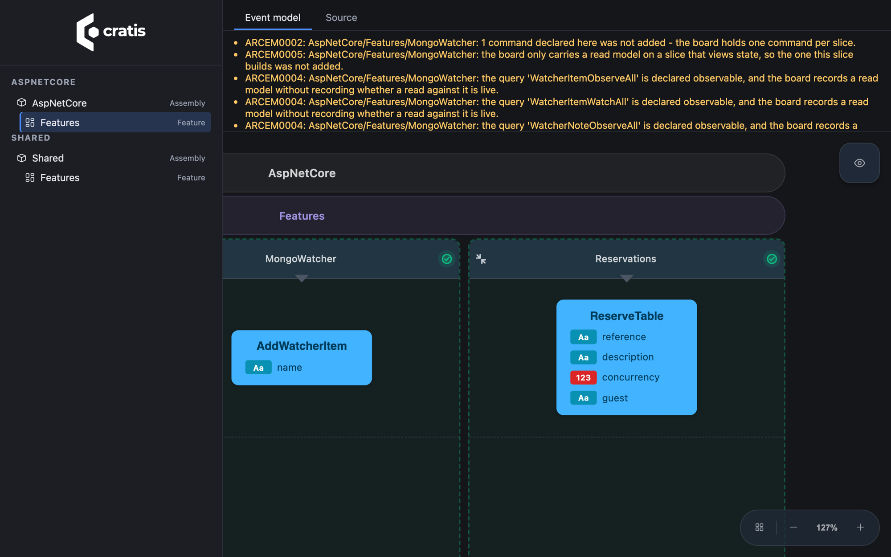

An event model is useful for as long as it matches the system. A wall of sticky notes stops matching it a few days after the code starts to exist. A diagram exported from a tool stops matching it at the first change nobody remembers to draw. A diagram derived from the code at runtime always matches what's there, but it can't tell you what was *meant* to be there. That's the question a review needs answered.

I think the model belongs in the repository, as text, next to the code it describes. Then a change to the model and a change to the code show up in the same pull request, CI can check the model, and an AI agent can read and propose changes to it the same way it does with code. And once the model is a file, any tool can draw it.

This week the same event model board is in every place I work. It's in VS Code, in an AI chat over MCP, in a running Arc application at `/.cratis/event-model/`, from the terminal with `cratis view`, and in Cratis Studio. They all use one renderer, so the board is the same one wherever you open it. Below I go through what each view reads, how to get to it, and where it stops.


*The Commerce sample from the Screenplay repository in VS Code: the board on the left, the `.play` file it's drawn from on the right.*

## The model is a file

[Screenplay](https://cratis.io/screenplay/) is the language. A `.play` file declares modules, features and slices of the four event-modeling types: `StateChange`, `StateView`, `Automation` and `Translate`. Each slice holds its commands, events, read models, rules, screens and Given/When/Then specifications. This is one slice from the Commerce sample, trimmed:

```screenplay
slice StateChange PlaceOrder
  description "A customer checks out their basket"

  command PlaceOrder
    orderId         OrderId identifier
    customerId      CustomerId
    lines           OrderLine[]
    shippingAddress Address

    authorize IsCustomer

    validate
      lines not empty  message "An order needs at least one line"

    produces OrderPlaced
      for orderId
      customerId      = customerId
      lines           = lines
      shippingAddress = shippingAddress

  event OrderPlaced
    customerId      CustomerId
    lines           OrderLine[]
    shippingAddress Address

  constraint OrderPlacedOnce
    unique event OrderPlaced
```

The full slice also carries three specifications and a screen. A folder of `.play` files is one application, and since Screenplay 4.48 a file can `import` others by path or glob. The compiler is the authority on whether a model is valid, and it runs anywhere:

```bash
cratis screenplay validate ./model --warnings-as-errors
```

The Commerce sample, three modules and 18 slices in 36 files, compiles with no errors and no warnings. In CI, that line fails the build when the model is broken, the same way a compiler error would.

## In the editor

Install the extension and open a `.play` file:

```bash
code --install-extension cratis.screenplay
```

The [VS Code extension](https://cratis.io/screenplay/vscode/) opens `.play` files on the board by default. **Show Source** puts the text beside it, and the board redraws as you type. For a file inside a folder application it shows the whole application, unsaved edits in other files included. The view options are the ones Cratis Studio has: full or overview detail, properties on or off, arrows or lines. The editor gives highlighting, completion, hover and diagnostics, and it validates the folder as one application, so a name declared in another file isn't reported as unknown.



*One line of `.play` added, saved, and the event is on the board.*

Two limits. The board is drawn by the extension's TypeScript parser, which reads the model but doesn't run the C# compiler's semantic checks, so a model the board draws can still be one `validate` rejects. And the board is dark whatever your color theme is.

## In the AI chat

An assistant that works on the model should be able to show you what it's proposing before anything is written. The Screenplay MCP server has a [`visualize-model`](https://cratis.io/screenplay/mcp-visualization/) tool that draws the board inside the chat, in MCP hosts that support [MCP Apps](https://modelcontextprotocol.io/extensions/apps/overview):

```bash
dotnet tool install -g Cratis.Screenplay.Tool
screenplay mcp ./model
```

It has three modes:

- **The model on disk.** Called with no arguments, it draws every `.play` document under the server root as one application. The model gets a short summary (how many slices and events, how many errors), and the documents go only to the board.
- **A proposal.** The server's authoring tools return a `proposalId` instead of writing files. Pass it to `visualize-model`, and *Current* and *Proposed* switch the board between the model as it is and as the proposal would leave it. What both share stays in place, so the difference is what moves. Nothing is written until you `apply` the proposal.
- **A what-if sketch.** Pass whole `.play` documents as a `sketch`, and they're drawn over the model on disk. A sketch is never validated as a proposal, never kept and never written.



*The board `visualize-model` returns, switched to Proposed for an unsaved what-if. Captured in a minimal MCP Apps test host, not a chat client.*

In hosts without MCP Apps you still get the server's other tools, just not `visualize-model`.

## In the running application

The model you write down and the code you ship can drift apart. To see what the code actually contains, Arc can generate Screenplay documents from your application's source at compile time and serve the board from the application itself.

```bash
dotnet add package Cratis.Arc.Screenplay.Embedded
```

```csharp
if (app.Environment.IsDevelopment())
{
    app.MapCratisEventModel();
}
```

Run the application and open `http://localhost:<port>/.cratis/event-model/`. You navigate by project, module and feature, and each document shows as a board or as its generated `.play` source. The viewer is bundled in the package, so nobody needs Node.js. When the code has something the board has no place for, such as more than one command in a slice, the viewer says so above the board instead of dropping it silently. The [Arc documentation](https://cratis.io/arc/backend/csharp/embedded-event-model/) covers the automatic hosting in the `Cratis` metapackage, choosing assemblies, and keeping generation out of Release builds.



*Arc's AspNetCore sample, viewed from the running application. Its commands don't append events, so the event lane is empty and the viewer lists what it couldn't place on the board.*

Know what it is. The board is derived from source and is read-only. It shows the commands, events and read models the generator recognizes, not stored events or live data. An Arc command that just returns a response has no event card, because Arc doesn't require event sourcing. The documents describe your application's structure, so keep the viewer to development or put your authorization policy on it. `MapCratisEventModel()` returns a route group, so `.RequireAuthorization("Developers")` works.

You can also do it without running anything. `cratis view` opens the same viewer for a `.csproj` on `127.0.0.1`. It reads the documents the build embedded, or generates them from source in memory when there are none:

```bash
cratis view ./Source/Store/Store.csproj
```

## In Cratis Studio

[Cratis Studio](https://cratis.studio) is where the board stops being read-only. It's a collaborative workspace where people and AI agents design, visualize and edit the same event model. A team brainstorms events on a shared board, models commands, events and read models on one canvas, and sees everyone's cursor as they work. A Studio model can be exported as Screenplay text, Mermaid or JSON, and imported back from Screenplay with a preview, so the `.play` files in your repository and the model in Studio can be passed back and forth. That round trip isn't lossless.

To share a self-contained model with someone who has no account, the Studio viewer takes the URL of a public `.play` file: `https://view.cratis.studio/?url=<encoded URL>`. It doesn't follow file imports yet, so a multi-file model like Commerce opens in the extension instead. Cratis Studio is live and in beta. Open signup is coming soon at cratis.studio, with a 14-day free trial.

## Start from the code you have

Most teams don't begin with an empty folder. `cratis screenplay generate` reads a project or solution and writes a `.play` document from what it recognizes. Today that covers Arc applications, Marten applications and Marten-with-Wolverine applications:

```bash
cratis screenplay generate ./Store.slnx --file store.play
cratis screenplay generate ./Shipping.csproj --provider critter-stack --file shipping.play
```

Regenerating an unchanged model gives a byte-identical file, so it diffs cleanly. Generating isn't reconstructing, though. The result is a starting point for a person to review, with diagnostics for what the generator recognized only in part. For Marten and Wolverine that includes sagas, tenancy, middleware and DCB. Marten and Wolverine are JasperFx Software projects, and Cratis's adapter for them is not affiliated with or endorsed by JasperFx. A [walkthrough sample](https://github.com/Cratis/Samples/tree/main/EventModeling/FromMartenAndWolverine) goes from an application to a validated model to the board.

From there the model can go the other way too. `cratis render` turns a model into an Arc and Chronicle application for the backend semantics it supports, and it refuses with a diagnostic rather than leaving a TODO. In Cratis Studio, a slice assigned to an AI agent can be rendered into C# for Arc and Chronicle and committed to a connected Git repository. That's one-way and per slice, and code generation is opt-in for each application.

## What it adds up to

Every one of these views reads the same thing, a Screenplay model. Some views read a file you wrote and others read a document generated from your code. When the two disagree, that's worth a conversation, and it's the conversation a diagram on a wall can't start.

The fastest way to see it is the extension and the sample:

```bash
code --install-extension cratis.screenplay
git clone https://github.com/Cratis/Screenplay.git
code Screenplay/Samples/Commerce
```

Then open any `.play` file. The [See your event model](https://cratis.io/screenplay/) guide covers every view, with the limits of each. Questions and bug reports are welcome on [GitHub](https://github.com/Cratis/Screenplay/issues).
