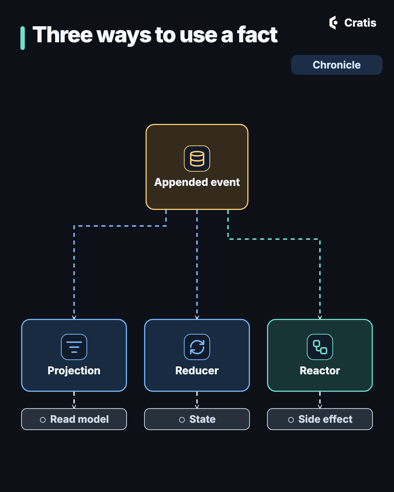

import { Tabs, TabItem } from '@astrojs/starlight/components';

An order row says the order has shipped. It doesn't say how it got there, which rule allowed each step, or whether the code that wrote it did what anyone meant it to do.

Almost every part of the Cratis ecosystem answers one of those gaps. In three lines:

- **Keep the facts.** Meaningful changes are recorded as events, in order, and current state is derived from them.
- **Make the model explicit.** The behavior is written down as an event model: screens, commands, events, read models and automations on one timeline.
- **Check the code against it.** Expected behavior is written as specifications, examples you can run, and the tooling lets you inspect what the system actually recorded.

Our [earlier overview](https://blog.cratis.io/the-cratis-ecosystem-at-a-glance/) listed the products. This one follows the wires between them, and a few of those wires are why I wanted to write it. Chronicle's projection language is compiled by the compiler for Screenplay, our experimental modeling language, so a projection written as text and a projection in a model share one language. Chronicle can encrypt personal data per subject, so when someone asks to be erased, destroying their key removes Chronicle's way to decrypt those values, and the event itself stays in the log. Prologue, which is also experimental, interprets approved metadata signals from selected sources such as SQL Server change data capture, PostgreSQL logical replication and OpenTelemetry into a candidate event model for people to correct. One feature folder can hold the code, the specs, the screen and the line in the model that points at them, so a reviewer sees all of it in one diff. And when an AI assistant proposes a change, the model, the specs and the event log each give you something different to check it against. Where a piece is experimental or otherwise early, I say so in the sentence that introduces it.

![A map titled How the Cratis pieces connect. Chronicle, the event-sourcing database and processing runtime, sits in the lower middle. Clients for C#, TypeScript, Kotlin/Java and Elixir connect to it, and it stores events in one configured provider: MongoDB, PostgreSQL, SQL Server or SQLite. Workbench, the CLI, the experimental Narrator and Chronicle MCP, which connects an AI assistant to a running Chronicle, inspect it. On the left, the experimental Screenplay MCP edits the experimental Screenplay model, and the experimental Prologue drafts a candidate model for it. The Screenplay model feeds the experimental Stage, which renders supported applications on Arc and Chronicle. Components consumes Arc's contracts in React, and Arc can append events through its optional Chronicle integration.](./ecosystem-map.png)

## A fact is not a row, and not a message

Event sourcing, as [Chronicle's documentation](https://cratis.io/chronicle/why-event-sourcing/) frames it, means keeping meaningful domain changes and their order as the authoritative history, and deriving the views you need from that history. Two distinctions matter more than the vocabulary.

The first is between a fact and a message. Publishing an `OrderPlaced` notification onto a bus tells other systems that something happened. A notification is built to be delivered. Whether it can be read again depends on retention. Publishing it does not, by itself, make it the authoritative history used to rebuild state. A retained event in an event log is that history. It can be read again, by a new projection, by a replay, or by someone asking what happened last Tuesday. Emitting events and event sourcing are different things, and a lot of confusion comes from treating them as one.

The second is between a request and a fact. A command asks for something and can be rejected. An event records something that did happen. Keeping those apart is what lets the log be trusted as history: nothing in it is a wish.

None of this means every table deserves an event stream. Chronicle's docs have a page on [when to use event sourcing](https://cratis.io/chronicle/concepts/when-to-use-event-sourcing/). For plain CRUD that only needs today's state, I would start with a simpler store. I think the pattern earns its cost where the history itself carries meaning: who changed what, in which order, under which rule.


## Chronicle: where the facts live

[Chronicle](https://cratis.io/chronicle/) is an event-sourcing database and processing runtime. The snippets in this article are copied from cratis.io as published, so the example names change from one to the next. In the .NET client, an [event type](https://cratis.io/chronicle/events/) is a plain record. The C# fragment below is from the [.NET example](https://cratis.io/event-sourcing/dotnet/); the other languages use the examples on the [events page](https://cratis.io/chronicle/events/):

<Tabs syncKey="language">
<TabItem label="C#">
```csharp
[EventType]
public record UserOnboarded(string Name, string Email);
```
</TabItem>
<TabItem label="TypeScript">
```typescript
import { eventType } from '@cratis/chronicle';
import { field } from '@cratis/fundamentals';

@eventType()
class EventsIndexEmployeeRegistered {
    @field(String) firstName: string;
    @field(String) lastName: string;

    constructor(firstName: string, lastName: string) {
        this.firstName = firstName;
        this.lastName = lastName;
    }
}
```
</TabItem>
<TabItem label="Kotlin">
```kotlin
import io.cratis.chronicle.events.EventType

@EventType
data class EventsIndexTypeEmployeeRegistered(val firstName: String = "", val lastName: String = "")
```
</TabItem>
<TabItem label="Java">
```java
import io.cratis.chronicle.events.EventType;

@EventType
record EventsIndexTypeEmployeeRegistered(String firstName, String lastName) {}
```
</TabItem>
<TabItem label="Elixir">
```elixir
defmodule MyApp.Events.EventsIndexTypeEmployeeRegistered do
  use Chronicle.Events.EventType, id: "events-index-type-employee-registered"

  defstruct [:first_name, :last_name]
end
```
</TabItem>
</Tabs>

[Appending](https://cratis.io/chronicle/events/appending/) an event to the event log is one call. The C# fragment is from the [.NET example](https://cratis.io/event-sourcing/dotnet/); the other languages follow the [events page](https://cratis.io/chronicle/events/):

<Tabs syncKey="language">
<TabItem label="C#">
```csharp
// Inject IEventLog or grab it from the event store
await eventLog.Append(Guid.NewGuid(), new UserOnboarded("Jane Doe", "jane@example.com"));
```
</TabItem>
<TabItem label="TypeScript">
```typescript
import { IEventStore } from '@cratis/chronicle';

class EventsIndexEmployeesService {
    constructor(private readonly store: IEventStore) {}

    async registerEmployee(employeeId: string, firstName: string, lastName: string): Promise<void> {
        await this.store.eventLog.append(employeeId, new EventsIndexEmployeeRegistered(firstName, lastName));
    }
}
```
</TabItem>
<TabItem label="Kotlin">
```kotlin
import io.cratis.chronicle.IEventStore
import io.cratis.chronicle.events.EventType

@EventType
data class EventsIndexLogEmployeeRegistered(val firstName: String = "", val lastName: String = "")

/**
 * The event log is the default event sequence, exposed through [IEventStore.eventLog].
 */
suspend fun registerEmployee(store: IEventStore, employeeId: String, firstName: String, lastName: String) =
    store.eventLog.append(employeeId, EventsIndexLogEmployeeRegistered(firstName, lastName))
```
</TabItem>
<TabItem label="Java">
```java
import io.cratis.chronicle.EventStore;
import io.cratis.chronicle.events.EventType;
import io.cratis.chronicle.eventSequences.AppendResult;

import io.cratis.chronicle.java.EventLogJavaBridge;

@EventType
record EventsIndexLogEmployeeRegistered(String firstName, String lastName) {}

class EventsIndexEventLog {
    // The event log is the default event sequence, exposed through EventStore.getEventLog().
    AppendResult registerEmployee(EventStore store, String employeeId, String firstName, String lastName) {
        return EventLogJavaBridge.append(store.getEventLog(), employeeId, new EventsIndexLogEmployeeRegistered(firstName, lastName), null);
    }
}
```
</TabItem>
<TabItem label="Elixir">
```elixir
defmodule MyApp.Events.EventsIndexEmployeeRegistered do
  use Chronicle.Events.EventType, id: "events-index-employee-registered"

  defstruct [:first_name, :last_name]
end

defmodule MyApp.EventsIndexEmployeesService do
  alias MyApp.Events.EventsIndexEmployeeRegistered

  def register_employee(employee_id, first_name, last_name) do
    Chronicle.append(employee_id, %EventsIndexEmployeeRegistered{
      first_name: first_name,
      last_name: last_name
    })
  end
end
```
</TabItem>
</Tabs>

The event source ID identifies the entity the event belongs to. Chronicle stores the event with its metadata in the event log, in order. That log is the source of truth, and everything else in this section is either derived from it or reacts to it.

### Your language, your database

The same append is documented for TypeScript, Kotlin, Java and Elixir. Chronicle has a first-class .NET SDK and additional TypeScript, Kotlin/Java (JVM), and Elixir clients, with a Python client coming soon. [The clients page](https://cratis.io/chronicle-clients/) has the install command for each; on Node.js it is:

```bash
npm install @cratis/chronicle
```

Java uses the same JVM artifact as Kotlin, so there is no separate Java package. All the clients talk to the same kernel through a common server contract, which is why the concepts in this section carry over: event types, appending, projections, reducers, reactors, constraints, PII. The docs show each of those mechanisms with tabs for C#, TypeScript, Kotlin, Java and Elixir, like the two tab groups below. That is documentation coverage, not a promise that every client has every feature; the [outbox and inbox page](https://cratis.io/chronicle/subscriptions/outbox-inbox/), for example, notes that one convenience helper exists only in C#.

The storage choice is made on the server. Chronicle supports MongoDB (the default), PostgreSQL, SQL Server and SQLite, plus an in-memory store that keeps nothing across restarts. The [storage configuration](https://cratis.io/chronicle/hosting/configuration/storage/) is a few lines:

```json
{
  "storage": {
    "type": "MongoDB",
    "connectionDetails": "mongodb://localhost:27017"
  }
}
```

The event-store API you program against stays the same when you change provider; how each provider behaves in operation is a separate question.


### Three ways to use a fact

Once a fact is in the log, three different things can happen to it, and Chronicle keeps them as separate concepts on purpose.

A [projection](https://cratis.io/chronicle/projections/) turns events into a [read model](https://cratis.io/chronicle/read-models/) shaped for one question. The [declarative](https://cratis.io/chronicle/projections/declarative/) form reads like a description of the view (these are fragments; the model and event type are defined separately in the [complete example](https://cratis.io/chronicle/projections/declarative/simple-projection/)):

<Tabs syncKey="language">
<TabItem label="C#">
```csharp
using Cratis.Chronicle.Projections;

public class DecSimpleUserProjection : IProjectionFor<DecSimpleUser>
{
    public void Define(IProjectionBuilderFor<DecSimpleUser> builder) => builder
        .From<DecSimpleUserCreated>();
}
```
</TabItem>
<TabItem label="TypeScript">
```typescript
import { IProjectionBuilderFor, IProjectionFor, projection } from '@cratis/chronicle';

@projection()
class DecSimpleUserProjection implements IProjectionFor<DecSimpleUser> {
    define(builder: IProjectionBuilderFor<DecSimpleUser>): void {
        builder.from(DecSimpleUserCreated);
    }
}
```
</TabItem>
<TabItem label="Kotlin">
```kotlin
import io.cratis.chronicle.projections.IProjectionBuilderFor
import io.cratis.chronicle.projections.IProjectionFor

class DecSimpleUserProjection : IProjectionFor<DecSimpleUser> {
    override fun define(builder: IProjectionBuilderFor<DecSimpleUser>) {
        builder.from(DecSimpleUserCreated::class)
    }
}
```
</TabItem>
<TabItem label="Java">
```java
import io.cratis.chronicle.projections.IProjectionBuilderFor;
import io.cratis.chronicle.projections.IProjectionFor;

class DecSimpleUserProjection implements IProjectionFor<DecSimpleUser> {
    @Override
    public void define(IProjectionBuilderFor<DecSimpleUser> builder) {
        builder.from(DecSimpleUserCreated.class);
    }
}
```
</TabItem>
<TabItem label="Elixir">
```elixir
defmodule MyApp.Projections.DecSimpleUserProjection do
  use Chronicle.Projections.Projection, model: MyApp.ReadModels.DecSimpleUser

  alias MyApp.Events.DecSimpleUserCreated

  from DecSimpleUserCreated
end
```
</TabItem>
</Tabs>

A [reducer](https://cratis.io/chronicle/reducers/) folds the events of one event source, in order, into a piece of state. A [reactor](https://cratis.io/chronicle/reactors/) is for side effects: sending an email, calling another system. [Observers](https://cratis.io/chronicle/concepts/observers/) track how far each of these has processed the log.



The separation matters most on a bad day. When a projection mapping is wrong, fix it and [rebuild the read model](https://cratis.io/chronicle/scenarios/rebuild-a-read-model/) by replaying the retained history. Replay reprocesses the event content Chronicle exposes, including applicable revisions and redaction markers. What it rebuilds is derived state; it doesn't prove that an email went out, which is why side effects live in reactors and not in projections.

Projections can also be written as text, and this is the first wire from the list at the top: Chronicle's [projection declaration language](https://cratis.io/chronicle/projections/projection-declaration-language/) (PDL) is compiled with the Screenplay compiler, which is experimental and comes back later in this article.

### Rules that have to hold when the fact is written

Some rules can't wait for a read model to catch up. Chronicle checks [constraints](https://cratis.io/chronicle/constraints/), such as uniqueness, when an event is appended, and rejects the append if it would break one. The scope of a constraint is the event sequence and the namespace, not every store you run.

[Concurrency](https://cratis.io/chronicle/events/concurrency/) is the other append-time check. Chronicle evaluates an append's declared concurrency expectation against its metadata scope. A conflicting append can be rejected so the caller can reconsider the new state. The first append into a scope is unchecked by default unless the caller opts in; an append without a usable expectation is also unchecked.

### History that changes shape, and a person who asks to be forgotten

Event types change as a system grows. Chronicle handles that with [generations of an event type](https://cratis.io/chronicle/understanding-event-evolution/). With migrations declared between generations, Chronicle produces upcast and downcast representations while retaining the originally stored generation, so code can read the shape it expects.

Personal data is harder, because an event log is exactly the place you don't want to rewrite. Chronicle's approach starts with a marker on the event type. [Marking a property `[PII]`](https://cratis.io/chronicle/compliance/pii/) tells Chronicle the value is personal:

<Tabs syncKey="language">
<TabItem label="C#">
```csharp
using Cratis.Chronicle.Compliance.GDPR;
using Cratis.Chronicle.Events;

[EventType]
public record PiiAttrEmployeeRegistered(
    [PII] string FirstName,
    [PII] string LastName,
    string Department);
```
</TabItem>
<TabItem label="TypeScript">
```typescript
import { eventType, pii } from '@cratis/chronicle';

@eventType()
class PiiAttrEmployeeRegistered {
    @pii() firstName = '';
    @pii() lastName = '';
    department = '';
}
```
</TabItem>
<TabItem label="Kotlin">
```kotlin
import io.cratis.chronicle.compliance.Pii
import io.cratis.chronicle.events.EventType

@EventType
data class PiiAttrEmployeeRegistered(
    @Pii val firstName: String,
    @Pii val lastName: String,
    val department: String
)
```
</TabItem>
<TabItem label="Java">
```java
import io.cratis.chronicle.compliance.Pii;
import io.cratis.chronicle.events.EventType;

@EventType
record PiiAttrEmployeeRegistered(
        @Pii String firstName,
        @Pii String lastName,
        String department) {
}
```
</TabItem>
<TabItem label="Elixir">
```elixir
defmodule MyApp.Events.PiiAttrEmployeeRegistered do
  use Chronicle.Events.EventType, id: "pii-attr-employee-registered"

  defstruct [:first_name, :last_name, :department]

  pii(:first_name)
  pii(:last_name)
end
```
</TabItem>
</Tabs>

Values marked this way are encrypted for the event's subject. Successful [key destruction](https://cratis.io/chronicle/compliance/key-lifecycle/) removes Chronicle's decryption path for ciphertext protected by those keys, while preserving the event slot; backups, exported keys and already-decrypted copies require separate handling. The event still records that something happened; Chronicle just can't decrypt the personal values in it any more.

It is a mechanism, not a certificate: on its own it doesn't make a system GDPR compliant, and anything that handles personal data still needs its own privacy review. There is [redaction](https://cratis.io/chronicle/events/redaction/) too, the [compliance overview](https://cratis.io/chronicle/compliance/) ties the pieces together, and [The log remembers](https://blog.cratis.io/the-log-remembers-pii-crypto-shredding-in-chronicle/) walks through the mechanism in detail.

### Tenants and other event stores

[Event stores and namespaces](https://cratis.io/chronicle/concepts/namespaces/) partition data, and [resolvers](https://cratis.io/chronicle/namespaces/) can pick a namespace per tenant; who may see which tenant, and how isolated tenants are in operation, is still your design. Persistent [subscriptions](https://cratis.io/chronicle/subscriptions/) carry events between event stores through [outbox and inbox sequences](https://cratis.io/chronicle/subscriptions/outbox-inbox/). That delivery is not a transaction, and Chronicle doesn't promise exactly-once delivery across it, so write receivers to handle an event they've already seen. The [architecture overview](https://cratis.io/chronicle/architecture/) shows how these parts fit around the kernel.

## Seeing what actually happened

After a bug report, the first question is usually: is the data wrong, or is the view wrong? Keeping facts only helps if you can look at them.

Start with Workbench. Chronicle Workbench provides a bundled local browser surface for authorized inspection of Chronicle runtime state and preview of supported projection behavior; the [Workbench docs](https://cratis.io/chronicle/workbench/) cover what it shows, and it isn't meant as a complete administration console. The Cratis [CLI](https://cratis.io/cli/) provides terminal workflows for [inspecting and diagnosing Chronicle](https://cratis.io/cli/chronicle/). If you live in your editor, [Narrator](https://cratis.io/tools/vscode-extension/), an experimental VS Code extension, browses Chronicle artifacts and history.

Then look at the events for that event source. If the events are right but the view is wrong, check the projection, its processing position and failures, and the query serving the view. If an event is wrong, trace the append path and the rules that admitted it. The log is evidence for that investigation, not the diagnosis by itself.

## Draw it before you build it: event modeling

[Event modeling](https://cratis.io/event-modeling/) maps a timeline of screens, commands, events, read models and automations, so the people involved can talk about cause and information flow before anyone writes the implementation. The cratis.io page writes a small library example as text. Drawn out, it looks like the diagram below. A reserve screen issues `ReserveBook`, which produces a `BookReserved` event. `BookReserved` events are projected into the `Availability` read model that the catalog screen reads, and the `StockKeeper` automation reacts to them.


A whiteboard model has no automatic check against the implementation, so it can drift as the code changes. There's also a subtler trap: a declared event type is not a recorded event. `BookReserved` in the model says the system is meant to be able to record it. Only the event log says it did.

## Screenplay: the model as a file

[Screenplay](https://cratis.io/screenplay/) is our experimental language for writing that model down as a versioned `.play` file. A `.play` file describes supported domain behavior and UI intent; the `Cratis.Screenplay` compiler and a command-line tool read it. [Why Screenplay](https://cratis.io/screenplay/why-screenplay/) explains the reasoning in more depth.

Because the model is a file, it lives in the repository, next to the code, and changes in the same history. It can also point at the code. This is from the [file references](https://cratis.io/screenplay/file-references/) page:

```screenplay
command RegisterInvoice
  invoiceId InvoiceId identifier
  handler
    file Invoicing/RegisterInvoice/RegisterInvoiceHandler.cs
```

`file` attaches an implementation to the command in the model. The same keyword can instead record where a pure declaration lives. Either way, a path is a pointer. Compilation checks the code's buildability; executable specifications check selected behavior against explicit expectations. Neither follows from a file reference alone.

### Why Screenplay sits in the middle

Several other pieces build on Screenplay or work with its models:

- Chronicle's [projection declaration language](https://cratis.io/chronicle/projections/projection-declaration-language/), as above, is compiled with the Screenplay compiler.
- [Prologue](https://cratis.io/prologue/), which is experimental, goes the other way. It interprets approved metadata signals from selected SQL Server CDC, PostgreSQL logical replication, HTTP and OpenTelemetry sources into a candidate event model for human correction; the captured metadata still needs privacy review.
- Stage, which is experimental, compiles Screenplay, checks the modeled specifications its runner supports, and renders supported Arc and Chronicle application shapes; specification verification and direct runtime execution are partial. The [Stage renderer guide](https://cratis.io/screenplay/stage/guides/build-renderer-target/) shows how a renderer target is built.
- Scene, also experimental, holds the platform-neutral UI vocabulary for describing a model's screens, along with a binding engine and a React renderer. Stage translates a compiled model into Scene to render them.
- Screenplay's [MCP authoring tools](https://cratis.io/screenplay/mcp-authoring/), part of the experimental Screenplay, let an AI assistant open and read a model and change it with typed syntax, with each change bound to a revision so it can be reviewed and recovered.

There is one rule in Screenplay I care about more than any single feature. Producers and consumers of a model have to declare what they can handle and expose what they can't represent, instead of dropping it silently. A tool that quietly loses part of your model is worse than one that refuses it.


## The application around the facts: Arc and Components

[Arc](https://cratis.io/arc/) is an opinionated CQRS application framework for ASP.NET Core with commands, queries, validation, authorization, and TypeScript proxy generation. It doesn't require event sourcing; [Chronicle integration](https://cratis.io/arc/backend/csharp/chronicle/) is optional. With both, the host setup from the [full-app walkthrough](https://cratis.io/build-a-full-app/) is this:

```csharp
var builder = WebApplication.CreateBuilder(args);

builder.AddCratis(
    configureArcBuilder: arc => arc.WithMongoDB(),
    configureChronicleOptions: chronicle => chronicle.EventStore = "Library",
    configureChronicleBuilder: chronicle => chronicle.WithCamelCaseNamingPolicy());

var app = builder.Build();

app.UseCratis();
app.Run();
```

The proxy generation is where the backend and the frontend meet. The React code calls commands and queries through TypeScript types generated from the backend, so it is type-checked against the backend's contracts. [The proxy boundary](https://cratis.io/arc/understanding-the-proxy-boundary/) page explains what crosses it. [Components](https://cratis.io/components/) is a React component library aligned with Arc application patterns, with command forms and dialogs and query-backed tables built on those contracts.

Arc is not only for .NET. [Arc for Kotlin](https://cratis.io/arc/backend/kotlin/) comes with a Spring Boot starter and can be used from Kotlin and Java. Arc for TypeScript is a source preview, and its npm packages are not published yet.

### At the edge: AuthProxy

[AuthProxy](https://cratis.io/authproxy/) is an edge proxy that sits in front of the backend and frontend. It handles [OIDC and OAuth2 sign-in, plus JWT bearer authentication](https://cratis.io/authproxy/configuration/authentication/), resolves the tenant, can put an invitation lobby in front of the app, enriches the identity and forwards the request. [Tenant resolution](https://cratis.io/authproxy/configuration/tenancy/) from a token claim looks like this:

```json
{
  "Strategy": "Claim",
  "Options": {
    "ClaimType": "tid"
  }
}
```

AuthProxy can enforce configured admission claims before forwarding a request; Arc still owns authorization for each command and query. Configure the [proxies in front of AuthProxy](https://cratis.io/authproxy/configuration/trusted-proxies/) for forwarded client-address and scheme headers, and establish the downstream identity and tenant-header trust boundary separately. The [auth and compliance](https://cratis.io/auth-and-compliance/) page shows how the pieces divide the work.

Ante is an early-stage (v0.x) invitation and onboarding lobby for Cratis applications.

## One feature, one folder

A layered codebase spreads one behavior across controllers, services, repositories, DTOs, a frontend folder and a test project. Arc recommends the opposite, a [vertical slice](https://cratis.io/arc/vertical-slices/). This is the example from that page:

```shell
✅ Organized by feature — one folder, read top to bottom
Authors/Registration/
├── Registration.cs        # command + Handle() + read model + query
├── AddAuthor.tsx          # the React screen
└── when_registering/      # the specs
```

The command, its handler, the read model and the query sit in one file, the React screen next to it, and the specs in a folder below. You read one feature top to bottom. It's a recommendation; Arc doesn't enforce it.


Now put the rest of this article into that folder. The experimental Screenplay model can point at `Registration.cs` with a `file` reference. The specs in `when_registering/` are written with [Specifications](https://cratis.io/specifications/), which is given/when/then examples on xUnit or NUnit that each describe one behavior, with analyzers that catch structural mistakes in the specs. Synopsis turns recognized specification shapes in C#, JavaScript, TypeScript, Gherkin and Screenplay into navigable, linked HTML, so the behavior the specs describe can be read as documentation; it doesn't run them.

So the model, the code, the specs and the screen live in one place and change together, in one diff. Nothing syncs them for you, but a reviewer, human or AI, now sees all four at once, and that is where drift can get caught.

## AI on the same model

An assistant that only sees code has to guess at intent. One that can read the event model, query the event store and run the specs has something to check its guesses against. We've built several tools for that, and they stay deliberately separate, because proposing, executing and observing are different acts.

**Rules and skills.** `cratis ai install`, a [CLI command](https://cratis.io/ai/getting-started/), installs Cratis rules and skills into the assistants you use, per product and per language:

```bash
cratis ai install \
  --harnesses claude,cursor,opencode,pi \
  --profiles cratis/chronicle,cratis/arc \
  --languages csharp,typescript
```

That gives an assistant context about how Cratis is meant to be used. It doesn't give it access to anything, and it doesn't make its output correct. The [AI section](https://cratis.io/ai/) of the docs covers what is in the corpus.

**The model.** Screenplay's MCP tools, part of the experimental Screenplay, let an assistant author a model with typed syntax and revision-bound changes. The [install page](https://cratis.io/screenplay/install-mcp/) starts with `dotnet tool install --global Cratis.Screenplay.Tool`.

**The running system.** [Chronicle MCP](https://cratis.io/chronicle-mcp/) communicates with the assistant over stdio and connects separately to a running Chronicle server. It gives the assistant tools for the operating side, such as events, jobs and observer health, and design-time tools grounded in the store's schemas. Runtime access means the assistant can read event payloads, and those can contain personal data, so scope what you connect it to. Anything the assistant reads that way is data, not instructions to follow.

**The docs.** [Prompter](https://cratis.io/prompter/), an experimental assistant, answers questions about the Cratis docs in Discord with citations you can follow, or refuses when it can't ground an answer. The documentation build also generates [llms.txt](https://cratis.io/llms.txt) and [llms-full.txt](https://cratis.io/llms-full.txt) indexes that point to the canonical pages.

### Four kinds of evidence

With a model in the loop, you can keep four kinds of evidence apart: a proposal, a declaration, a specification result and an observation. These answer different questions: what was proposed, what the model declares, what a specification checks, and what the running system recorded. A passing specification does not approve a proposal or prove deployed behavior. I think keeping them apart is the most useful habit when working with an assistant.

A hypothetical, to make that concrete. Say you ask an assistant to stop two authors registering under the same name. Its suggested diff is a proposal. If you write the rule into the event model, that is a declaration. A spec in `when_registering/` that registers the same name twice and expects a rejection checks one example, and it either passes or it doesn't. In Chronicle, the rule could be a uniqueness constraint, checked within its event sequence and namespace when the event is appended. And once the feature runs, the event log shows what was actually recorded, including any duplicate that got through. The first three are things someone writes. The fourth is what the running system recorded.


## Where each piece stands

Some of this is the established core, and some of it is early. Cratis publishes a connected .NET product path in which Arc owns CQRS application contracts, Components provides React components aligned with Arc application patterns, Chronicle supplies an independently usable event-sourced runtime, and Workbench and the Cratis CLI provide bounded Chronicle inspection surfaces. Each of those keeps its own package, release, compatibility, license, support and independent-use boundary. Chronicle and its bundled local Workbench are available as MIT-licensed self-hosted software; authorized local use is separate from paid Cratis support, hosted coordination, or managed operational responsibility. For other products, check the license in each repository instead of assuming it.

The rest carries a label in the sentence that introduces it above. To collect them in one place:

- **Experimental:** Screenplay, Stage, Scene, Prologue, Narrator and Prompter. Syntax and behavior in these can still change.
- **Released packages without a maturity label in their own documentation:** AuthProxy, Specifications, Synopsis, Arc for Kotlin/Java and Chronicle MCP. They are described here by what they do, with no production, parity or compatibility claims.
- **Source preview, not published to npm:** Arc for TypeScript.
- **Coming soon:** the Python client for Chronicle.

The direction for experimental Screenplay is to move from describing behavior toward verifying it, with tools declaring which semantics they can handle. Experimental Stage is part of that work through supported rendering and partial specification execution. That is the direction we're working toward. I won't put dates on it.

Two more things we're building:

We're building Cratis Studio: an experimental, collaborative place where people and AI design, visualize and edit the same event model. It's early, and I'll share more when there is more to show.

We're building Cratis Direct: it turns repository signals into one prioritized queue of bounded AI work, and brings the results back as pull requests for people to review. It is an internal experiment the team uses on its own work.

## Try it

- Start with [Get started with Chronicle](https://cratis.io/chronicle/get-started/), append a few events and open the [Workbench](https://cratis.io/chronicle/workbench/) to see them.
- On Node.js, `npm install @cratis/chronicle` and follow the [TypeScript client](https://cratis.io/chronicle/clients/typescript/) docs. The [Kotlin](https://cratis.io/chronicle/clients/kotlin/) and [Elixir](https://cratis.io/chronicle/clients/elixir/) clients have their own pages.
- For a full application, run `dotnet new install Cratis.Templates` from [Getting started](https://cratis.io/templates/getting-started/) and follow [Build a full app](https://cratis.io/build-a-full-app/). The [templates](https://cratis.io/templates/) cover Chronicle console and web apps, Arc with React (with or without Aspire), and a Kotlin/Java full stack. Keep each feature in one folder.
- Before your next feature, sketch one slice with [event modeling](https://cratis.io/event-modeling/): the screen, the command, the event, the read model.
- If you use an AI assistant, run `cratis ai install` for the products and languages you use, and try keeping a proposal, the model, a spec and the event log apart when you review what it did.
- If you want to see where the model-first work is going, install the experimental Screenplay tool from [Getting started with Screenplay](https://cratis.io/screenplay/getting-started/) and write one `.play` file.
