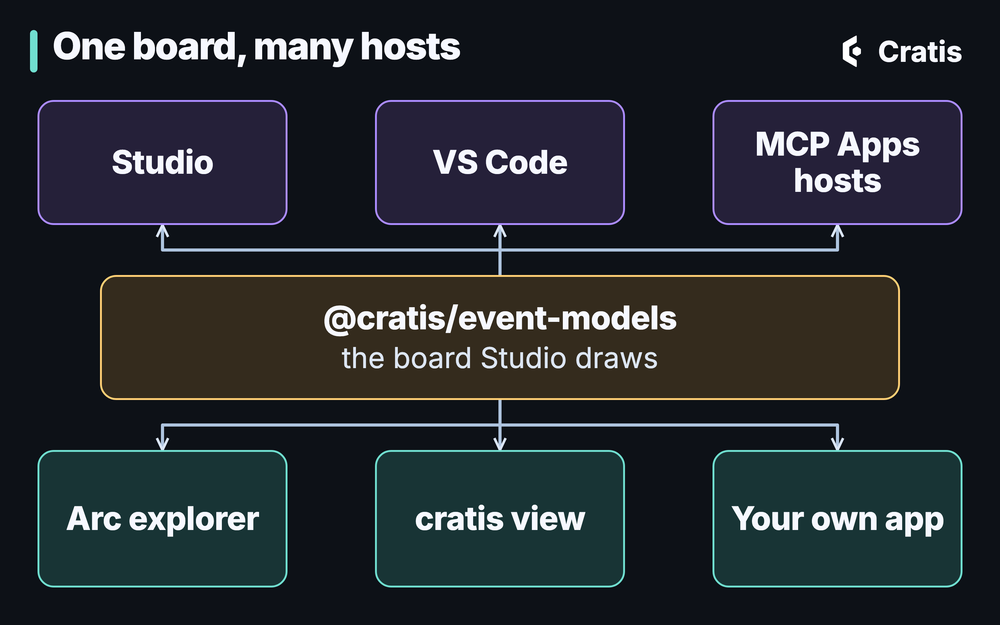
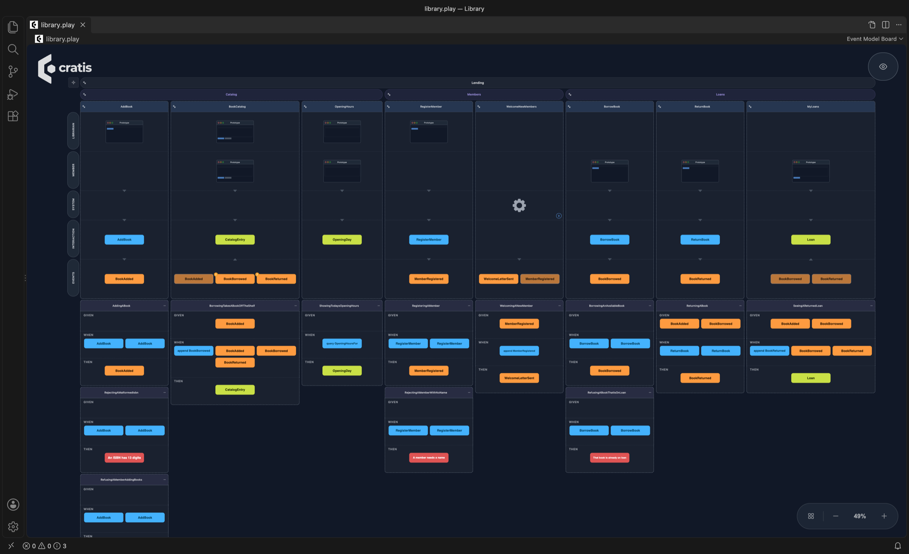
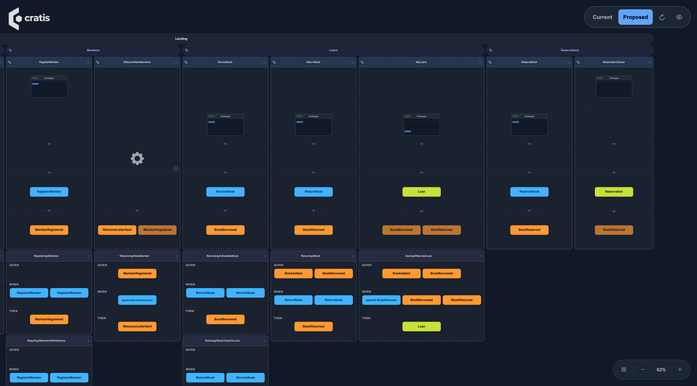
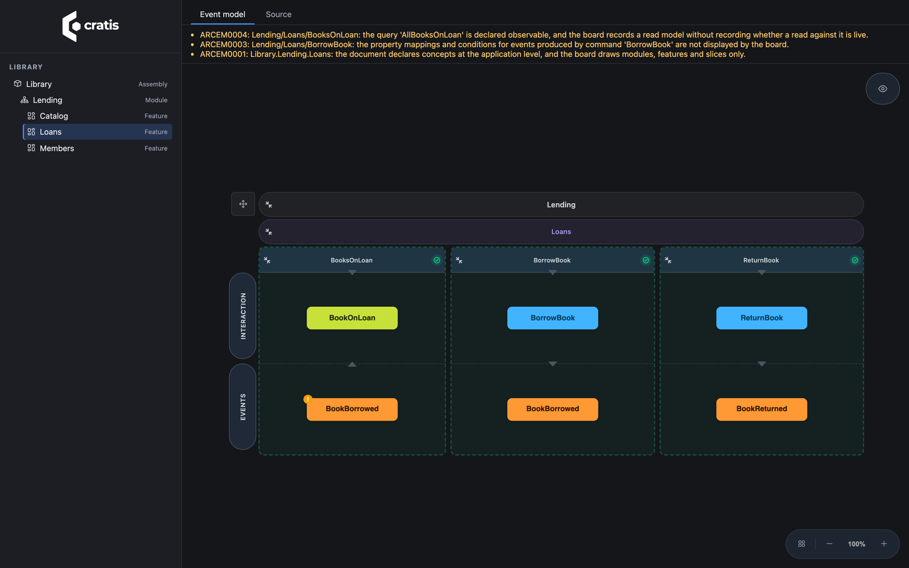
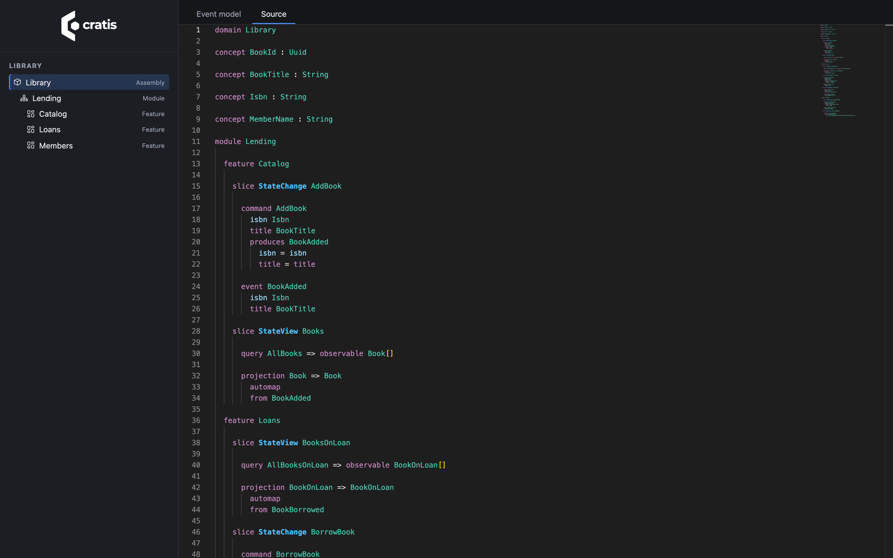

Let's face it, nobody gets excited about intermediate languages. Hardly anyone writes IL by hand, and I've yet to meet someone who reads JVM bytecode for fun. Yet I would argue they're among the most important ideas our industry ever had.

Think about what IL actually did for .NET. C#, F# and VB all compile down to the same thing. The runtime only has to understand that one thing. And every tool that came after, debuggers, decompilers, profilers, analyzers, obfuscators, got to work on *every* language for free, because they only had to read IL. The JVM got the exact same superpower from bytecode, which is why Kotlin and Scala could show up years later and inherit an entire ecosystem on day one. Languages above, tools below, and a small, stable, well-defined format in the middle that both sides agree on.

The thing is, the business side of software has never had that. We've had whiteboards, sticky notes, Miro boards, Word documents, Jira epics and a lot of very good intentions. None of them are something a compiler can check, a tool can read, or a pull request can diff. So the moment the code exists, the model starts drifting away from it.

That's what [Screenplay](https://cratis.io/screenplay/) is for, and over the last couple of weeks it really clicked for me what it has become: **the assembly language of the business**.

## A quick recap of what Screenplay is

Screenplay is a small, indentation-based language for writing down an event model: modules and features, slices, commands, events, read models, screens, policies, personas and the specifications that say what should happen. It lives in `.play` files next to your code, it has a compiler with stable diagnostic codes, and it prints back to the same text it read. It's young, so expect it to keep moving.

This is a slice from the Library sample that ships with Screenplay:

```text
slice StateChange AddBook
  description "The librarian adds a newly bought book to the catalog"

  command AddBook
    bookId BookId identifier
    isbn   Isbn
    title  BookTitle
    author AuthorName

    authorize IsLibrarian

    validate
      isbn matches "^[0-9]{13}$"  message "An ISBN has 13 digits"
      title not empty             message "A book needs a title"

    produces BookAdded
      for bookId
      isbn   = isbn
      title  = title
      author = author

  event BookAdded
    isbn   Isbn
    title  BookTitle
    author AuthorName
```

If you want the language tour, Sindre did a great job with that in [Screenplay: an event model you can compile](/screenplay-an-event-model-you-can-compile/). What I want to talk about here is not the language itself. It's everything that now sits *around* it.


That picture is the whole point of this post. On the left are all the ways a Screenplay document comes into existence. A person writes it in an editor. An AI assistant proposes it through the Screenplay MCP server. [Cratis Studio](https://cratis.io/studio/) exports it from the board you've been modeling on together. The Cratis CLI generates it from Arc, Marten or Wolverine source code with [`cratis screenplay generate`](https://cratis.io/cli/reference/screenplay/). And [Prologue](https://cratis.io/cli/reference/prologue/) interprets one from what an existing system is observed doing. On the right are the things that read it. Same file format in the middle, every single time.

Exactly like IL. Nobody on the left has to know who's on the right.

## One board, extracted out of Studio

The first piece of the puzzle was making sure that whatever reads Screenplay can *show* it, and show it the same way everywhere.

Studio has had a very nice event model board for a while. The problem was that it lived inside Studio. So we pulled it out. [`@cratis/event-models`](https://www.npmjs.com/package/@cratis/event-models) is now a published, MIT-licensed npm package containing the exact board Studio draws, both the read-only viewer and the editor. It's released together with Studio and carries Studio's version number, which is still `0.x`, so pin a minor version and expect the API to move a bit.

Rendering a board in your own React app is pretty much this:

```tsx
import { createRoot } from 'react-dom/client';
import { EventModelBoard, readEventModelDocument } from '@cratis/event-models';
import '@cratis/components/tokens';
import '@cratis/components/styles';
import '@cratis/components/theme';
import '@cratis/event-models/theme';
import '@cratis/event-models/styles';
import '@cratis/scene/styles';
import 'primeicons/primeicons.css';
import json from './library-model.json';

const model = readEventModelDocument(json.eventModel);

createRoot(document.getElementById('root')!).render(
    <div style={{ height: '100vh' }}>
        <EventModelBoard document={model} readOnly />
    </div>
);
```

The JSON it reads is the board model of a small library application, which I'll get to in a moment.


*The board from `@cratis/event-models`, in a page that contains nothing else.*

Once the board was a package, it could go anywhere. And it went to a lot of places in a short amount of time.



## Open a .play file, get a board

The [Screenplay VS Code extension](https://cratis.io/screenplay/vscode/) now opens `.play` files on the event model board by default. It's the same board as Studio, with modules and features across the top, a column per slice, the personas as rows with screens drawn as small prototypes in them, and the Given/When/Then specifications hanging underneath each slice.

```shell
code --install-extension cratis.screenplay
```

The text is still the source of truth. Run **Show Source** from the command palette and you get the `.play` file side by side with the board, with highlighting, completion, hover and diagnostics, and the board redraws as you type.


*The Library sample in VS Code: the board on the left, the Screenplay it's drawn from on the right.*

Zoom out and you get the whole application in one picture. A picture of the system is something I've wanted for every system I've built, and this one is drawn from the very file the rest of the tooling reads.



## Your AI assistant gets a whiteboard

This is the one that made me smile the most.

The [Screenplay MCP server](https://cratis.io/screenplay/mcp/) has been around for a bit, letting an assistant explore a model, find declarations, find gaps in your specifications and *propose* changes that a person reviews and applies. Over the last week it gained a bunch of new capabilities. It now picks its workspace by itself (from the folder you name, the folder your client offers, or the folder you started it in), it ships as [desktop bundles for Claude Desktop and a local plugin for ChatGPT Desktop](https://cratis.io/screenplay/mcp/install/), and the CLI can install and update those for you with `cratis screenplay mcp install`. It guides the assistant towards valid models *before* it proposes anything, and it can propose typed repairs for some diagnostics instead of just complaining about them.

And it can draw.

The server now offers the board as an [MCP App](https://modelcontextprotocol.io/extensions/apps/overview), a view the host renders right inside the conversation, through a tool called `visualize-model`. In [hosts that render MCP Apps](https://cratis.io/screenplay/mcp/view/), like Claude Desktop and GitHub Copilot in VS Code, you can just say *"Show me the application as an event model board"* and there it is. While it's on screen it follows the files on disk, so when the assistant applies a change or you edit a file by hand, the board catches up on its own.

The part I find really powerful is the what-if. Ask the assistant to sketch something without changing anything:

```text
Without changing anything, sketch what a Reservations feature could look like next
to the existing Lending module, and show it on the board. Do not propose it yet.
```

The board then shows the application as the sketch would leave it, with a **Current** and **Proposed** switch in the toolbar. Whatever both share stays in place, so the only thing that moves is the difference.


*A sketch of a Reservations feature drawn over the Library sample. Nothing is written to disk.*

This changes the conversation with an assistant quite a bit. Instead of reading a wall of generated text and trying to imagine what it does to the model, you *look* at what it would do, before anything is written. And since the board is the same board you'd see in Studio or VS Code, there's nothing new to learn.



## Your running application already knows its model

Now for the other direction. Everything so far is about a Screenplay someone, or something, wrote. But what about the code you already have?

In [Arc](https://cratis.io/arc/), we've added `Cratis.Arc.Screenplay.Embedded`. During compilation it analyzes your commands, events, read models, projections and reactors, generates Screenplay documents from them, one for the assembly and one per module and feature, and embeds them in your assembly. Generation errors fail the build rather than embedding something the Screenplay compiler would reject. The `Cratis` metapackage includes it, and `UseCratis()` maps a read-only explorer at `/.cratis/event-model/` for a Debug-built application running in Development. You don't have to do anything.

Here's the explorer in a fresh application from the template (`dotnet new cratis`), where I replaced the sample feature with a small library (adding books, borrowing and returning them, registering members and a reactor welcoming them) and ran it with `dotnet run`.


*The explorer in a running Arc application, with the View options open.*

A few things worth calling out here.

This is source-derived documentation, not a view of live data. It shows what your code *says* the model is, not what's in the event store. It's also read-only, of course, since the code is the source.

The board is honest about what it can't draw. See those warnings at the top? The analysis found things a board card can't express, like a reaction whose body is code, or property mappings on a produced event, and instead of quietly dropping them it tells you. The **Source** tab always gives you the full generated Screenplay.

And being a Debug build in Development isn't authorization. The explorer exposes your application's structure, so the [docs](https://cratis.io/arc/backend/csharp/embedded-event-model/) cover turning it off or putting a policy on it if that instance is reachable by anyone but you. Turning it off is one line, and a policy goes on the route group:

```csharp
builder.Services.AddCratisEventModelViewer(options => options.Enabled = false);
```

```csharp
app.MapCratisEventModel().RequireAuthorization("Developers");
```

One thing I ran into while writing this: a project that pulls in `Microsoft.CodeAnalysis.Analyzers` transitively can hit an MSBuild target cycle with the embedded generation in Debug ([Arc#2979](https://github.com/Cratis/Arc/issues/2979)). Our own Library showcase in the Samples repository turns the generation off for that reason until it's fixed. The template app doesn't have the problem.

## No need to run anything: cratis view

Now, starting an application just to look at its model is a bit much. Especially when the model is the thing you wanted to look at *before* you set up its database.

So the Cratis CLI got [`cratis view`](https://cratis.io/cli/reference/view/). Run it in the folder of a `.csproj` and it serves the very same explorer from your machine and opens a browser on it.

```shell
cratis view
```

If the built assembly embeds Screenplay documents, those are what you see. If it doesn't, or you pass `--from-source`, it generates them from the project's source in memory with the same Arc generator the build uses, without writing a single file. None of your application's code runs, the assembly isn't locked so you can keep rebuilding, and it only listens on loopback.





*The same application through `cratis view` (Cratis CLI 3.27.0), without starting it. Board on top, the generated Screenplay below.*

That last screenshot is the one I keep coming back to. That's C# code, compiled down to the business's assembly language, and then drawn as an event model. It's ILDASM for your domain.

## Why the format in the middle matters

Let me get back to the IL thing, because I think it's the real story here and not just a cute analogy.

None of what I've shown you required the tools to know about each other. VS Code doesn't know about Arc. The MCP server doesn't know about the CLI's `view` command. Arc doesn't know about Studio. They all speak Screenplay, and they all draw it with the same board package. Every new thing that can *produce* a `.play` file gets every viewer for free, and every new viewer works for every producer. That's exactly the leverage IL gave .NET.

It goes the other way too. Screenplay is what [`cratis run`](https://cratis.io/cli/reference/run/) boots into a live sandbox, and what `cratis render` turns into an application. The more things that can read and write the format, the more valuable each `.play` file becomes.

Which is also why so much of the last couple of weeks went into the language itself. Applications composed from many files through imports, events declared inline where they're produced, optional values written as `Type optional`, deterministic clocks, reactions, triggers and captures. On top of that you can now write down event sources and streams, external systems and command operations, and handler implementation intent, although those are syntax only for now: the compiler and the editors understand them, but nothing executes them yet. Studio exports more of its model to Screenplay and says out loud what it couldn't carry. An intermediate language is only as good as what it can express, and every one of those makes it a little more complete.

## Wrapping up

I've spent most of my career building platforms for developers, and the one thing I've always wanted is for the model the business talks about and the code we ship to be the *same thing*. Not two things we try to keep in sync. Screenplay is not there yet, and there are still things the board can't draw. But for the first time I can point at a single format that people, AI assistants, Studio and our C# code all write, and that VS Code, an MCP host, a running Arc application and the CLI all read and draw the same way.

If you want to give it a go:

- Install the [VS Code extension](https://cratis.io/screenplay/vscode/) and open a `.play` file. The [Screenplay samples](https://github.com/Cratis/Screenplay/tree/main/Samples) are a good start, Library in particular.
- Run [`cratis view`](https://cratis.io/cli/reference/view/) in one of your Arc projects and look at the model you've already written.
- Connect the [Screenplay MCP server](https://cratis.io/screenplay/mcp/install/) to Claude Desktop or Copilot in VS Code, and ask it to show you the board.

And if you build something that reads or writes Screenplay, I'd love to hear about it. That's kind of the whole point.

---

*Versions: .NET SDK 10.0.400, Cratis CLI 3.27.0 (bundling Screenplay 4.60.1), the `cratis.screenplay` VS Code extension 4.62.1, `Cratis` 22.50.3 from `Cratis.Templates`, and `@cratis/event-models` 0.117.3.*
